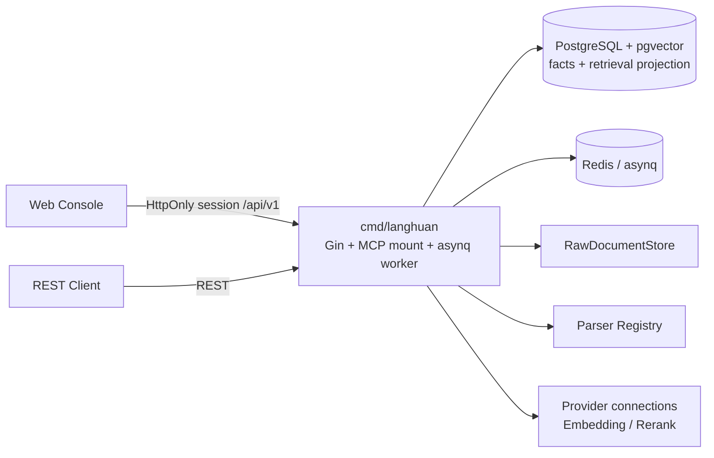
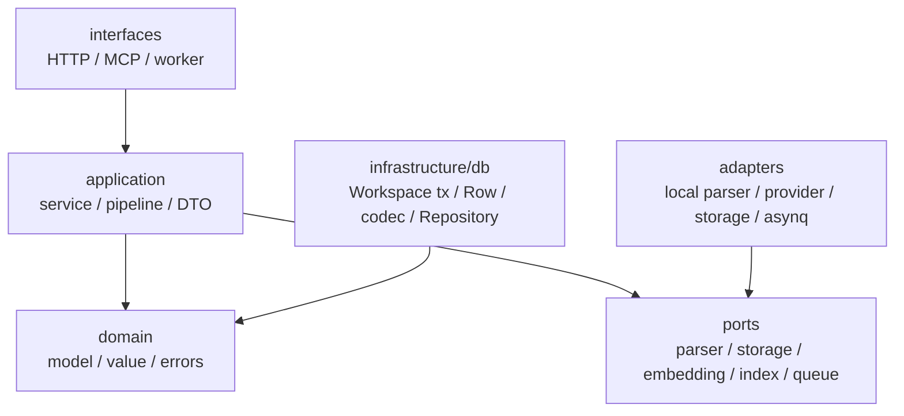
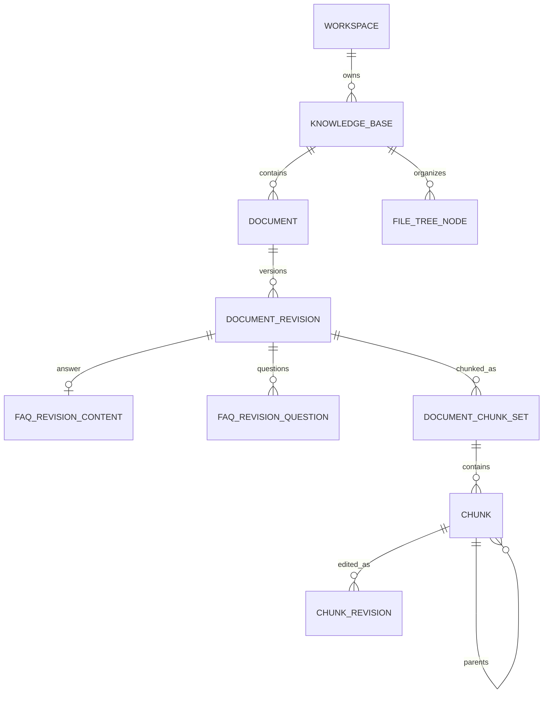
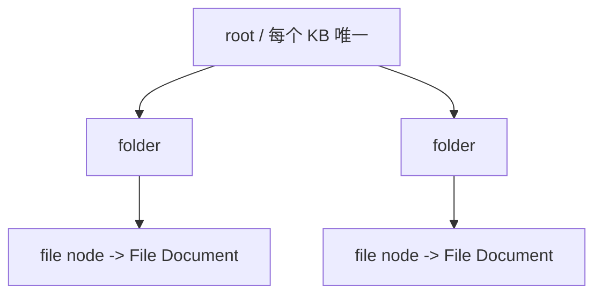
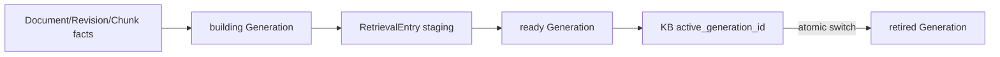
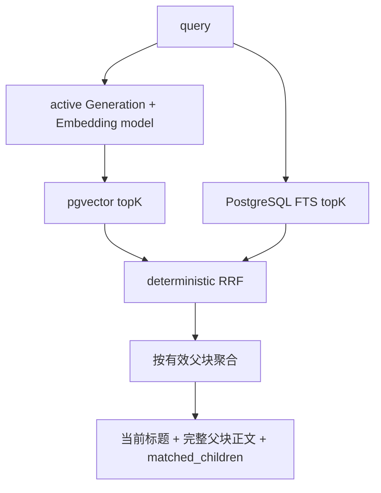

# 琅嬛架构设计

琅嬛是 RAG 工程中的知识转化与检索服务。当前主链路支持 File、FAQ 和 Web 三类 Document，完成解析、版本化分块、Embedding/FTS 投影、Generation 重建切换与混合检索；不调用 LLM 生成答案，不编排 Chat/Agent，也不实现图查询。Web Document 已有稳定数据合同，但 crawler 不在当前范围。

## 1. 系统上下文



同一个二进制承载 REST、MCP HTTP 挂载点和 worker。Redis 只承载任务队列；Document、Revision、Job、Generation 和检索投影状态以 PostgreSQL 为准。

### Provider 连接与模型

`model_providers` 表示共享连接（Endpoint、加密凭证、scope、status），`models` 表示连接下的具体模型实例。服务启动时由显式 `ProviderDescriptorRegistry` 声明每个 provider key 的能力；应用服务按 `model.type` 精确路由 Factory，不再按 embedding/rerank registry 的 first-hit 顺序推断。一个连接可以声明多个能力，例如 `siliconflow` 同时声明 `embedding` 与 `rerank`，两类模型共享同一 API Key 与 Base URL。

```text
ProviderDescriptor(siliconflow)
├── shared config/credentials codec
├── Embedding Factory -> /v1/embeddings
└── Rerank Factory    -> /v1/rerank
```

Provider API 返回服务端 descriptor 的 `capabilities` 与按模型 status/type 聚合的 `model_counts`；管理型模型目录支持 `type/status/scope/provider_id/q` 筛选。Generation 选择接口仍只接受精确的 `type=embedding|rerank`，保持原合同。

Provider descriptor 可选实现 `ModelCatalog` port。目录适配器接收已规范化连接配置和一次性解密凭证，调用供应商模型列表接口并归一化为临时选项（名称、类型、维度和模型参数）；HTTP 层在返回前清理凭证，前端只在用户点击时加载并填充 RHF 草稿，明确不自动持久化。OpenAI-compatible `/models` 与 SiliconFlow `/v1/models` 已提供实现，后续火山、百炼、智谱或 DeepSeek 只需注册自己的 descriptor/adapter。

## 2. 边界与分层



- Domain 是纯 Go 类型，不依赖 HTTP、GORM、pgvector 或第三方 SDK。
- Application 定义使用方接口和最小事务合同，编排业务状态与外部端口。
- HTTP/MCP/worker 只做协议转换、身份上下文提取和错误映射。
- Repository 是 GORM 薄封装；原生 SQL 仍通过注入的 `*gorm.DB` 执行。
- 所有 I/O 透传 `context.Context`；日志不得记录正文、向量、凭证或第三方完整响应。

## 3. SaaS 租户边界与 RLS-ready

Workspace 是租户、成员权限和数据隔离边界。所有知识业务表直接保存 `workspace_id uuid NOT NULL` 与 `UNIQUE (workspace_id, id)`；下级资源用包含 Workspace/KB/Document 的复合外键阻止跨租户 lineage。

业务数据库访问进入 `WorkspaceTxRunner.WithinWorkspace`：

```sql
SELECT set_config('app.workspace_id', $1, true);
```

配置是 transaction-local，不泄漏到连接池中的后续请求。查询仍显式带 `workspace_id`；该条件负责当前隔离，`app.workspace_id` 为未来 PostgreSQL RLS 提供上下文。

当前版本不启用 RLS policy，也不修改 user/session/workspace/membership/invitation/API token/Provider/Model 授权合同。正式启用 RLS 需要独立迁移、非 owner 应用角色、`ENABLE + FORCE ROW LEVEL SECURITY` 和两 Workspace 负向矩阵。

## 4. 知识事实模型



### 4.1 Document 与 Revision

`documents.kind` 是不可变业务类型：

- `file`：上传或同步得到的文件；在知识库 File Tree 中恰好有一个活动 file node。
- `faq`：一组有序问题和一个回答；不进入 File Tree。
- `web`：由规范化 URL 标识的网页来源；不进入 File Tree，当前不实现 crawler。

`source_type` 表达 `upload|api|crawler|sync` 等采集渠道，不替代 kind。改变 kind 必须创建新 Document。

Document 只保存稳定身份、当前标题、来源、状态和 active Revision 指针。文件类型、原始文件名、raw storage key、hash、大小、解析产物都属于不可变 DocumentRevision。重新解析或替换文件创建新 Revision；只重新分块不创建 Revision。

### 4.2 FAQ aggregate

FAQ Revision 必须同时包含一个非空回答和至少一个有序、去重后的非空问题。创建/更新以完整 aggregate 原子提交，不存在“新问题配旧回答”的中间状态。

FAQ 固定生成一个 `strategy=faq` Chunk：

```text
source_content: Q: 问题一\nQ: 问题二\nA: 回答
embedding_content/search_content: 问题一\n问题二
content: 回答
```

因此用户以任一问题召回，最终 evidence 返回回答；回答中的独有词不进入 Embedding 或 FTS。

### 4.3 ChunkSet、Chunk 与 ChunkRevision

DocumentChunkSet 表示一次分块产物，配置 hash 使构建可幂等复用。普通 File/Web 使用 Generation 的 `strategy=standard` 分块配置；其中的 `chunking_config.strategy` 选择边界策略（`auto|heading|heuristic|recursive`）。FAQ 永远使用独立、版本化的 `strategy=faq`，不受普通分块配置改变影响。

Chunk 保存稳定来源、sequence、source content 和 SourceAnchor。标准分块使用以下角色合同：

- 父子模式（默认启用）同时生成 `parent` 和 `child`。`parent` 保存完整上下文，只用于结果返回，`parent_chunk_id` 必须为空，不能直接编辑或启停；每个 `child` 必须通过同一 Workspace/KB/Document/Revision/ChunkSet 内的 `parent_chunk_id` 关联一个父块。
- `child` 是向量与全文召回的最小单元；短文本也必须生成一个父块和一个子块，不能退化为无父块的 child。
- 关闭父子模式时，只生成 `flat`，其 `parent_chunk_id` 为空，且自身既是召回单元也是返回正文。父块不是 flat 模式的必需产物。
- `parent` 与 `flat` 的 sequence 各自独立；child sequence 在同一角色内稳定排序。相邻父块可按 `chunk_overlap` 保留上下文，但 child 只归属一个 parent，父块正文不会因子块 overlap 重复拼接。

系统或用户内容保存在 ChunkRevision；`child` 与 `flat` 的人工编辑追加 Revision，并通过 `base_revision_id` 做乐观并发控制。启停也是新 Revision，不覆盖来源事实；父块由分块配置派生，始终只读。

Generation 的标准分块快照在 `chunker_version=3` 时固定保存六个字段：`strategy`、`enable_parent_child`、`parent_chunk_size`、`child_chunk_size`、`chunk_size`、`chunk_overlap`。默认值为 `auto`、`true`、`4096`、`384`、`512`、`80`。父子模式使用前两个尺寸分别控制返回上下文和召回粒度，`chunk_overlap` 用于相邻父块；flat 模式使用 `chunk_size/chunk_overlap`。`auto` 优先利用标题结构，纯文本使用启发式章节边界，不能识别时回退 recursive。

## 5. 独立 File Tree



`file_tree_nodes` 只表达知识库内的认知组织，不是对象存储目录，也不承载版本、检索或权限继承。

- root 在 KB 创建事务中生成；每个活动 File Document 恰好一个 file node。
- 同父目录下 folder/file 共用大小写不敏感名称空间。
- move 使用 recursive CTE 拒绝移到自身或后代；非空 folder 删除返回冲突。
- file node rename 同事务同步 `documents.title`；检索结果读取当前 node name。
- rename/move 不创建 Revision、不修改 raw key、不增加 content version，也不会让 building Generation stale。

## 6. 单活双缓冲检索投影



KnowledgeBase 的当前 Embedding model、chunking config 和 retrieval config 都来自 active Generation。Generation 是不可变快照，并记录 source/indexed content version、构建统计、人工编辑处置和错误分类。

同一 KB 最多一个 building Generation。构建在 inactive Generation 中完成，激活时锁定 KB/candidate/base 并校验：

- candidate 为 ready；
- `base_generation_id` 仍指向当前 active；
- `source_content_version` 等于 KB 当前 content version；
- 重新分块会归档人工编辑时，调用方明确确认。

通过后只切换 KB active 指针并退役旧代。失败重试不会把 ready/completed 状态降级，队列失败也不会留下永久 building Generation。

## 7. RetrievalEntry 与混合检索

`retrieval_entries` 同行保存 lineage、`search_content`、返回用 `content`、`fts_document`、`halfvec embedding` 和状态。父块永不产生 RetrievalEntry；只有启用的 `child` 或 `flat` 会进入 staging，并且只有 active Generation 的 `published` 行可查询。



- 向量维度只允许 798、1024、2048、3584；代码选择四条固定 halfvec SQL。
- 查询 cast、distance expression 和 dimension predicate 必须与对应 HNSW 部分索引完全一致。
- FTS 只查询保存的 `fts_document`，不从返回 `content` 重建。
- RRF 在 application 层确定性融合；同分按 UUID 升序。
- 子块命中会按其有效父块聚合，避免同一父块的多个子块占用多个结果名额。结果的 `chunk_id`、`content`、`source_anchor` 指向父块；`matched_children` 保留参与召回的 child 及其分数和锚点。flat 命中保持自身为结果，并在 `matched_children` 中以 `role=flat` 表示。
- evidence 不信任 RetrievalEntry 中的标题快照。File 返回当前 node name；FAQ/Web 返回当前 `documents.title`。
- Search 只返回 evidence，不生成 LLM 答案。

## 8. 文档流水线与幂等

File/Web：

```text
raw validation/storage
  -> transaction: Document + file node(File only) + Revision + Job
  -> parse Revision
  -> build/reuse standard ChunkSet
  -> embed search_content + stage RetrievalEntry
  -> atomic publish and pointer switch
```

PDF 先由 MinerU Cloud 解析为 Markdown，再由 Markdown parser 重建结构化 `parse_manifest`，随后进入与其它 File 相同的标准分块与索引流程；不会直接按 MinerU 原始文本片段写入 Chunk。

FAQ：

```text
transaction: Document/next Revision + answer + all questions + Job
  -> build/reuse one FAQ Chunk
  -> embed questions only + stage RetrievalEntry
  -> atomic publish and pointer switch
```

Worker payload显式包含 Workspace、KB、Document、Revision、Generation 和 Job lineage。handler 只解码并调用 application pipeline；任务重入先检查 ready/published/terminal 状态。FAQ 不调用 parser/raw storage，File/Web 不读取 FAQ 子表。

## 9. 状态、删除与保留

Document v2 状态固定为：

```text
pending -> processing -> ready
                    \-> failed
ready/failed -> deleting -> deleted
```

Document 删除在一个 Workspace transaction 中：

1. 把该 Document 的非 retired RetrievalEntry 全部退役；
2. 写入 `status=deleted` 与 `deleted_at`；
3. File 删除唯一 file node，FAQ/Web 不触碰无关树节点。

删除是软删除。Revision、raw object 与资产保留到恢复窗口结束，不能在 HTTP 删除请求中立即销毁原文件。

可重建数据按 YAML 保留策略清理：failed/staging 默认 24 小时，retired Entry/Generation 默认 168 小时。Cleanup 按 Workspace 使用稳定 ID、`FOR UPDATE SKIP LOCKED`，每次最多一个 batch；active Generation 永不物理删除。

## 10. REST 与权限

浏览器认证使用 HttpOnly session。跨 Workspace 资源统一隐藏为 404。当前知识路由包括：

```text
POST   /api/v1/workspaces/:workspace_slug/knowledge-bases
GET    /api/v1/workspaces/:workspace_slug/knowledge-bases/:id
POST   /api/v1/workspaces/:workspace_slug/knowledge-bases/:id/documents
POST   /api/v1/workspaces/:workspace_slug/knowledge-bases/:id/documents/faq
GET    /api/v1/workspaces/:workspace_slug/documents/:document_id
DELETE /api/v1/workspaces/:workspace_slug/documents/:document_id
GET    /api/v1/workspaces/:workspace_slug/knowledge-bases/:id/chunks/:chunk_id
GET    /api/v1/workspaces/:workspace_slug/knowledge-bases/:id/file-tree
POST   /api/v1/workspaces/:workspace_slug/knowledge-bases/:id/search
POST   /api/v1/workspaces/:workspace_slug/search
GET    /api/v1/workspaces/:workspace_slug/knowledge-bases/:id/index-generations
```

member 可以读、上传、创建/更新 FAQ、操作允许的文件树、删除 Document 和 search；Chunk 编辑/启停、Generation 创建/激活要求 admin/owner。授权表和现有角色语义未改变。

## 11. 配置

```yaml
retrieval:
  failed_staging_retention: 24h
  retired_generation_retention: 168h
  cleanup_batch_size: 1000
```

duration 必须大于 0；batch 必须为 1–10000。Cleanup service 已在 runtime 装配为可调用的 Workspace-scoped 能力；当前不引入进程级全租户扫描 scheduler。

## 12. 验证与后续边界

数据库验收覆盖复合外键、FAQ 完整性、父子分块 lineage 与 flat 回退、父块不入索引、完整父块检索上下文、文件树 cycle/name/delete、Revision 冲突、Generation 原子切换、FAQ 答案不入索引、HNSW 表达式兼容、跨租户负向矩阵和 Auth/Model 数据保留。

当前非目标：正式 RLS policy、crawler、LLM 回答生成与图查询。

> Rerank 已于当前版本交付：检索在 Vector/FTS + RRF + parent 聚合后，按 active Generation 的可选不可变 Rerank 快照执行一次重排，返回 `rerank_score` 与 `ranking_stage`（`rrf`/`rerank`/`rrf_fallback`）。多知识库检索要求所有 active Generation 的 Rerank 快照完全一致或全部关闭，否则在模型调用前返回 `rerank_configuration_conflict`。Rerank 模型身份、config hash、候选数与失败策略作为 Generation 快照固化，运行时与快照不一致时拒绝执行。
