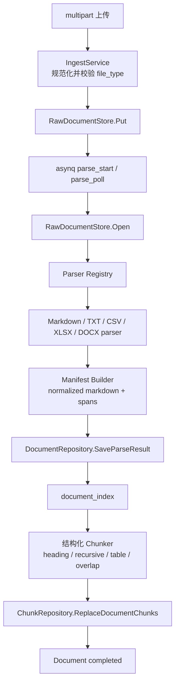

# 琅嬛 v0.3.0 多格式解析与分块设计规格

> 状态：已于 2026-07-30 按本规格实现并完成验收。

## 1. 背景

v0.2.0 已交付 workspace-scoped 文档上传、原始文件存储、Document/Job 状态机、asynq 任务链和 stub pipeline；v0.2.1 已交付用户、session、workspace membership 与权限边界。当前上传文件能够经过 `document_parse_start -> document_parse_poll -> document_index` 到达 `completed`，但解析和分块仍是占位实现：

- `ParseStage` 没有从 `RawDocumentStore` 打开上传文件，真实 parser 拿不到文件内容。
- 运行时仍装配 stub parser，只根据文档元数据生成固定 Markdown。
- `ChunkStage` 把整篇 Markdown 保存为一个 chunk，没有使用知识库的 `chunking_config`。
- parser 结果只有 Markdown，没有可跨异步任务持久化的结构和来源映射。
- `chunks` 没有独立的 `embedding_content` 字段。
- `ingest.allowed_file_types` 已存在于配置中，但上传链路没有真正执行白名单校验。
- worker 失败处理不能区分永久解析错误与可重试基础设施错误，也没有可靠地在终止重试时同步 document 状态。

ROADMAP 已将 v0.3.0 调整为不依赖外部解析服务的本地多格式解析与分块。PDF/MinerU、图片资产归档、Embedding、pgvector、FTS、检索和 Web Console 均不属于本版本。

## 2. 已确认的产品决策

本规格采用以下已确认决策：

1. `chunk_size` 和 `chunk_overlap` 的单位是 Unicode 字符数，不是模型 token 数。默认值继续为 `512/80`。
2. DOCX 本版本只处理正文标题、段落、列表和表格。图片不抽取、不落盘，只记录非致命 warning。
3. v0.3.0 不支持 PDF。PDF 在上传入口直接拒绝，不创建 raw file、Document 或 Job。
4. CSV/XLSX 首版按基础表格规则处理：每个 sheet 独立、首个非空行作为表头、每个 table chunk 重复表头、公式使用可读取的显示值或缓存值。复杂表格识别留待后续优化。

## 3. 目标

v0.3.0 交付以下闭环：

```text
Markdown / TXT / CSV / XLSX / DOCX 上传
  -> 保存 raw document，创建 Document 与 Job
  -> worker 打开 raw document
  -> 按 file_type 选择本地 parser
  -> 生成 normalized_markdown 与版本化 parse_manifest
  -> 按知识库 chunking_config 生成稳定 chunks
  -> 保存 content / embedding_content / context_header / source_anchor
  -> Document completed
```

具体目标：

- 五种格式均使用真实文件内容解析，不调用外部解析服务。
- 不同格式统一进入 `ParsedDocument -> parse_manifest -> Chunk` 主链路。
- 解析结构和来源锚点可跨 `parse`、`index` 两个异步任务持久化。
- chunk 能回溯到原始文本 offset、CSV/XLSX 行列或 DOCX 段落/表格位置。
- 表格按完整行分块并重复表头，不把单元格内容任意截断。
- 相同文件、相同 parser 版本和相同 chunking 配置产生确定性一致的 chunk sequence、content 和 source anchor。
- 现有 workspace 鉴权、上传 API、Document/Job 查询合同和任务名保持兼容。

## 4. 非目标

v0.3.0 明确不做：

- PDF 或 MinerU Cloud。
- DOCX/XLSX 内图片提取、图片 OCR、对象存储资产归档或 Markdown 图片 URL 改写。
- 密码保护 Office 文件破解。
- 旧版二进制 `.doc`、`.xls`。
- 自动字符集探测或 GBK/Big5 转码；文本输入只接受 UTF-8，可带 UTF-8 BOM。
- CSV 分隔符自动推断；`.csv` 按 RFC 4180 风格逗号分隔解析。
- XLSX 跨 sheet 合并、复杂表头推断、多区域表格识别或数据透视表语义恢复。
- DOCX 页码恢复。DOCX 是流式排版格式，没有渲染器时不伪造 page anchor。
- Embedding API、tokenizer、pgvector、FTS、搜索、rerank 或 MCP 业务工具。
- 文档删除、重建索引 API、批量导入、管理台页面。
- 为 parser/chunker 预留图数据库、其它向量库或进程内事件总线抽象。

## 5. 方案比较与选择

### 5.1 方案 A：只保存 normalized Markdown

parser 只输出 Markdown，ChunkStage 再解析 Markdown 生成 chunk。

优点：改动最少，数据模型简单。

缺点：Markdown 无法完整表达 XLSX sheet、原始行列、DOCX paragraph/table index 等来源信息；parse 与 index 是不同任务，临时解析结构不能跨任务保留。依赖 Markdown 反推来源会产生不可验证的近似锚点。

结论：不采用。

### 5.2 方案 B：版本化 JSONB parse manifest

parser 输出 normalized Markdown，同时输出只记录结构、normalized Markdown span 和来源锚点的版本化 manifest。Document 聚合把 manifest 保存为 JSONB，ChunkStage 在后续任务中读取并消费。

优点：

- 能精确跨任务传递结构和来源信息。
- manifest 与 Document 同生命周期，不需要独立 block 查询接口。
- 不重复保存每个 block 的正文，只保存 Markdown byte span，避免大文档正文在 JSONB 中再次复制。
- 版本字段允许未来兼容升级，但当前只实现 version 1。

缺点：需要新增 typed codec 和 span 一致性校验。

结论：采用。它直接解决当前真实需求，同时没有引入独立聚合或多余查询层。

### 5.3 方案 C：document_blocks 关系表

每个解析 block 单独保存为数据库行，ChunkStage 查询 block 行生成 chunks。

优点：block 可独立查询、分页、统计和局部更新。

缺点：当前没有 block 级产品 API；会增加表、repository、事务和级联生命周期，且 chunk 仍需额外聚合 block。属于为尚不存在的需求提前建模。

结论：不采用。

## 6. 总体架构



依赖边界：

- `interfaces/http` 只接收文件和映射 HTTP 错误，不选择 parser。
- `interfaces/worker` 只解码任务、推进任务状态并调用 pipeline。
- `application/service` 在保存 raw file 前执行支持格式校验，确保未来 MCP 导入复用同一规则。
- `application/pipeline` 负责打开 raw document、调用 parser、保存解析结果并生成 chunks。
- `ports/parser` 定义同步本地 parser 合同；具体格式实现在 `adapters/parser/*`。
- Chunker 是确定性的应用层纯逻辑，不是外部系统，不为它定义 port。
- `infrastructure/db` 负责 manifest/anchor 的 Row codec 和事务持久化。

## 7. 解析合同

### 7.1 Parser 接口

v0.3.0 保持同步本地 parser 合同，不为 v0.8.0 的异步 MinerU 提前加入 `Start/Poll` 抽象。worker 的 `parse_start/parse_poll` 任务名继续保留，未来 PDF adapter 可在不污染本地 parser 的前提下增加异步能力。

概念接口：

```go
type ParseInput struct {
    FileType   string
    Title      string
    Content    []byte
    Metadata   map[string]any
}

type ParsedDocument struct {
    Markdown string
    Manifest model.ParseManifest
}

type DocumentParser interface {
    Parse(ctx context.Context, input ParseInput) (*ParsedDocument, error)
    Supports(fileType string) bool
}
```

约束：

- `Content` 是从 `RawDocumentStore.Open` 有界读取的真实文件内容。
- parser 不访问数据库、Redis、对象存储或 HTTP handler。
- parser 必须周期性检查 `ctx.Err()`，尤其是 XLSX/DOCX 的 sheet、row、XML token 循环。
- parser 不记录完整文档内容。
- parser 输出必须通过 manifest 校验后才能保存。

### 7.2 Parser Registry

新增组合 parser，按规范化 file type 路由：

| 输入 | 规范化类型 | adapter |
|---|---|---|
| `.md`、`.markdown` | `markdown` | `parser/markdown` |
| `.txt` | `txt` | `parser/text` |
| `.csv` | `csv` | `parser/csv` |
| `.xlsx` | `xlsx` | `parser/xlsx` |
| `.docx` | `docx` | `parser/docx` |

Registry 初始化时拒绝重复注册同一规范化类型；运行时找不到 parser 返回 typed `unsupported_file_type` 错误。现有数据库中的 `md` 值继续作为兼容 alias 支持，新上传统一保存为 `markdown`。

### 7.3 Manifest Builder

各 parser 不自行拼接易漂移的全局 offset。共享 builder 按顺序追加规范化 Markdown block，并记录该 block 在最终 Markdown 中的半开区间 `[normalized_start, normalized_end)`。

offset 规则：

- `normalized_start/end` 是最终 `normalized_markdown` 的 UTF-8 byte offset，用于安全、无歧义地切片原字符串。
- `chunk_size/overlap` 仍按 Unicode rune 计数，两种 offset 不混用。
- block span 必须位于 Markdown 长度内、按 sequence 单调递增且互不重叠。
- block 之间的规范化空行由 builder 统一插入，不属于任一原始 block。

## 8. Parse manifest 模型

### 8.1 领域模型

领域层使用纯 struct，不带 JSON/GORM tag：

```text
ParseManifest
  version              int                固定为 1
  parser               string             markdown/text/csv/xlsx/docx
  parser_version       int                本版本固定为 1
  blocks               []ParsedBlock
  warnings             []ParseWarning

ParsedBlock
  sequence             int                从 0 连续递增
  kind                 BlockKind
  normalized_start     int                UTF-8 byte offset，含
  normalized_end       int                UTF-8 byte offset，不含
  heading_path         []string
  source_anchor        SourceAnchor
  metadata             map[string]any

ParseWarning
  code                 string
  message              string             不含原文或敏感内容
  source_anchor        SourceAnchor
```

`BlockKind` 首版固定为：

- `heading`
- `paragraph`
- `list`
- `quote`
- `code`
- `thematic_break`
- `table_header`
- `table_row`

表格 block 用 `metadata.table_id` 关联；`table_header` 的 span 包含 Markdown 表头行与分隔行，后续 `table_row` 每行一个 block。Chunker 因而可以重复表头并按完整数据行组合，而不需要再次猜测表格结构。

### 8.2 SourceAnchor

`SourceAnchor` 是 typed value object。不同 parser 只填自身有意义的字段：

| 字段 | Markdown/TXT | CSV | XLSX | DOCX |
|---|---:|---:|---:|---:|
| `source_type` | 是 | 是 | 是 | 是 |
| `offset_start/end` | 是 | 否 | 否 | 否 |
| `line_start/end` | 是 | 是 | 否 | 否 |
| `sheet` | 否 | 固定 `CSV` | 是 | 否 |
| `header_row` | 否 | 表格时 | 表格时 | 表格时 |
| `row_start/end` | 否 | 是 | 是 | 表格行 |
| `column_start/end` | 否 | 是 | 是 | 表格列 |
| `paragraph_start/end` | 否 | 否 | 否 | 正文段落 |
| `table_index` | 否 | 否 | 否 | 表格 |

规则：

- 所有人类可读的行、列、段落和表格序号均从 1 开始。
- `offset_start/end` 是原始逻辑文本按 Unicode rune 计数的半开区间。
- chunk 合并多个连续 block 时，anchor 合并成覆盖范围；不连续来源不得合并成一个 chunk。表格重复表头是唯一例外，使用独立 `header_row` 与连续的数据行范围表达，不能把两者伪装成一个连续范围。
- chunk 完整包含一个或多个 block 时，anchor 是这些 block 的最小覆盖范围。普通文本 block 被 recursive split 后，如果规范化转义导致 normalized offset 无法一一映射回原文，子 chunk 保留父 block 的准确来源范围，并设置 `metadata.anchor_granularity=block`；不得计算貌似精确但无法验证的子范围。
- DOCX 本版本不包含 `page` 字段。未来 PDF 进入时通过 manifest 版本兼容扩展，不在本版本伪造页码。
- `chunks.source_anchor` 继续保存 JSONB，但通过 typed codec 写入和读取。

### 8.3 持久化编码

`DocumentRow.ParseManifest` 使用项目已有 `JSONMap`。repository 提供显式 `parseManifestToJSONMap` / `parseManifestFromJSONMap`，不在 domain model 上增加 JSON tag。

codec 必须：

- 校验 version、parser、sequence、span 和 anchor 数值。
- 对未知 manifest version 返回可诊断错误，不静默降级。
- 对未知 metadata key 原样保留。
- 空数据库默认值 `{}` 解码为“未解析”，不伪装成 version 1。

`GET document` 暂不暴露完整 parse manifest；它是内部 pipeline 合同。现有 `normalized_markdown` 响应保持不变。

## 9. 各格式解析规则

### 9.1 Markdown

使用 Goldmark AST，并启用 GFM table 能力。

规则：

- 去除 UTF-8 BOM，统一 CRLF/CR 为 LF。
- 保留 heading、paragraph、list、blockquote、fenced code、thematic break 和 table 语义。
- heading path 在遇到同级或更高层 heading 时正确出栈。
- fenced code 内的 `#`、空行、管道符不参与标题或表格识别。
- 原始图片语法作为普通 Markdown 内容保留；本版本不下载、不改写。
- source anchor 记录原始 rune offset 与行号。

### 9.2 TXT

规则：

- 只接受合法 UTF-8，可带 BOM。
- 统一换行后，以一个或多个空行为段落边界。
- TXT 中类似 Markdown 的 `#`、`|`、反引号等只代表普通文本；输出 normalized Markdown 时做必要转义，避免改变原文语义。
- 每个段落生成 `paragraph` block，source anchor 记录原始 rune offset 与行号。
- 只有空白的文件返回永久 `empty_document` 错误。

### 9.3 CSV

使用标准库 `encoding/csv`：

- 支持 quoted field、字段内逗号和字段内换行。
- 首个非空记录作为表头；其前面的全空记录忽略。
- 后续记录列数不足时补空单元格，超过表头列数时扩展匿名列名 `Column N`，保证 Markdown 表结构合法。
- Markdown 单元格转义 `|`，把单元格内换行规范化为 `<br>`。
- 生成一个 `table_header` 和若干 `table_row` block，共用稳定 `table_id`。
- source anchor 使用 CSV 逻辑记录号；字段内换行不改变记录号语义，同时保留 `line_start/end` 供诊断。
- 无非空记录返回永久 `empty_document` 错误。

### 9.4 XLSX

使用 Excelize 读取 workbook，禁止公式外部网络访问。

规则：

- 按 workbook sheet 顺序处理所有非空 sheet，包括 hidden sheet；hidden 状态写入 block metadata。
- 每个 sheet 先输出 sheet heading，再输出独立 table。
- 首个非空行作为表头；后续直到最后一个非空行作为数据行。
- 使用 Excelize 可读取的格式化值或缓存值；公式字符串不直接进入正文。
- 合并单元格首版使用左上角值，其余位置视为空，不尝试推断多级表头。
- 空 sheet 跳过；所有 sheet 均为空时返回 `empty_document`。
- 表格锚点记录 sheet、header row、数据行范围和实际使用列范围。
- adapter 使用包内具名常量限制 OOXML：ZIP entry 不超过 10,000 个、总声明解压大小不超过 512 MiB、单个 XML part 不超过 128 MiB；并在 sheet/row 循环中检查 context，防止压缩炸弹或取消失效。

### 9.5 DOCX

DOCX adapter 使用 Go 标准库 `archive/zip` + `encoding/xml` 读取必要 OOXML 部件，不引入 AGPL 或要求运行时 license key 的依赖。

选择依据：已考察的 `github.com/fumiama/go-docx` 使用 AGPL-3.0；UniOffice/gooxml 当前要求商业许可证。v0.3.0 只需要正文结构的只读子集，自有 adapter 更小、更可控，且替换边界仍是 `DocumentParser`。

读取范围：

- `word/document.xml`：正文段落与表格。
- `word/styles.xml`：paragraph style、heading/outline 映射。
- `word/numbering.xml`：列表层级的基础识别。

规则：

- 按正文顺序输出 paragraph、heading、list 和 table blocks。
- heading 优先读取 outline level，再识别常见 `Heading1` / `标题 1` 类 style 映射；无法识别时作为 paragraph。
- 连续同一列表生成 list block；保留嵌套层级但不追求 Word 自定义编号样式的视觉完全还原。
- 表格首个非空行作为表头，后续每行作为 `table_row`；单元格内段落用 `<br>` 连接。
- 图片、drawing、textbox、页眉页脚、脚注、尾注、批注遇到时忽略正文提取，并记录去重 warning code；warning 不包含图片二进制或原文。
- 加密、损坏、缺少 `word/document.xml` 的文件返回永久 `invalid_document`。
- adapter 使用与 XLSX 相同的安全上限：ZIP entry 不超过 10,000 个、总声明解压大小不超过 512 MiB、单个 XML part 不超过 128 MiB。先验证声明大小，再通过有界 reader 读取实际内容，不能只信任 ZIP header。

## 10. Chunker 设计

### 10.1 输入与输出

输入：

- `Document`：ID、title、normalized Markdown、parse manifest。
- `KnowledgeBase.ChunkingConfig`：`chunk_size`、`chunk_overlap`。

输出：`[]*model.Chunk`，sequence 从 0 连续递增。

Chunk 字段：

| 字段 | 语义 |
|---|---|
| `content` | 可展示、可追溯的 normalized Markdown 片段 |
| `context_header` | 文档标题与当前 heading path 或 sheet 名，不修改 content |
| `embedding_content` | 有 context 时为 `context_header + "\n\n" + content`，否则等于 content |
| `source_anchor` | 合并后来源范围 |
| `metadata` | parser、manifest version、block kind、table ID、oversized 等非敏感信息 |

`chunk_size` 只约束 `content` 的 Unicode rune 数，不包含 `context_header`。v0.4.0 在调用具体 embedding 模型前再增加 token 上限保护。

### 10.2 heading-aware

- heading block 更新当前 heading path。
- 顶级章节之间不合并普通内容。
- heading 本身进入后续第一个 chunk 的 content；同一章节的后续 chunk 通过 `context_header` 保留路径。
- 文档标题与首个 heading 相同时去重，避免 embedding content 重复标题。

### 10.3 recursive split

普通文本 block 超过目标大小时按以下优先级递归切分：

1. block 边界
2. 段落/列表项边界
3. 换行
4. 中英文句末标点
5. Unicode rune 安全边界

不得按 byte 任意截断 UTF-8。fenced code 优先保持完整；单个 code block 超过限制时允许在换行边界拆分，并在每个 chunk metadata 标记来自同一 code block。

### 10.4 overlap

- overlap 只在相邻普通文本 chunk 且 heading path 相同时应用。
- 优先重复完整的最小语义单元；仍超过 overlap 时按 rune 截取尾部。
- overlap 不跨章节、不跨 table、不重复 heading block。
- `chunk_overlap >= chunk_size` 不是有效配置。新建知识库时返回 validation error；读取旧配置时归一化为小于 chunk size 的安全值。

### 10.5 table-aware split

- `table_header` 与相同 `table_id` 的连续 `table_row` 组成一个表格。
- 每个 table chunk 都包含表头和 Markdown 分隔行。
- 只在完整数据行之间切分，不拆分单元格或单行。
- table 不使用普通文本 overlap；重复表头就是结构性上下文。
- 如果“表头 + 单个数据行”已经超过 chunk size，仍输出完整 oversize chunk，并设置 `metadata.oversized=true`，不牺牲表格可理解性。
- source anchor 的 `row_start/end` 表示该 chunk 的数据行范围，`header_row` 单独保存，避免把重复表头误认为连续数据范围。

### 10.6 确定性

- parser block sequence、table ID、chunk sequence 不使用随机数参与计算。
- chunk ID 可以继续使用 UUID；验收确定性比较 sequence、content、context header、embedding content 和 source anchor，不要求重复执行后 UUID 相同。
- repository 每次原子替换同一文档的全部 chunks，重复执行不累积重复行。

## 11. 数据库增量与兼容性

新增迁移 `000003_multi_format_parsing_chunking`：

```sql
ALTER TABLE documents
    ADD COLUMN IF NOT EXISTS processing_version integer NOT NULL DEFAULT 0,
    ADD COLUMN IF NOT EXISTS parse_manifest jsonb NOT NULL DEFAULT '{}'::jsonb;

ALTER TABLE chunks
    ADD COLUMN IF NOT EXISTS embedding_content text NOT NULL DEFAULT '';
```

`processing_version` 的现实用途是隔离 v0.2.0 stub 产物：

- v0.2.x 已存在文档保持 version 0，不自动改状态、不自动入队。
- v0.3.0 新导入文档创建时写 version 1。
- `dedupe=true` 只复用当前 processing version 的文档，不能把旧 stub `completed` 文档误当成真实解析结果。
- 旧文档仍可查询；重新上传同一文件会创建 version 1 文档。
- 本版本不增加旧文档自动 reprocess；手动 reindex/reprocess API 仍留在后续可靠性版本。

Repository 调整：

- `SaveParseResult` 在一次 `UPDATE` 中写入 normalized Markdown、parse manifest 和 parsed 状态，避免 manifest 与状态分离；parser 名称、版本和 warning 已包含在 manifest，不覆盖用户的 `documents.metadata`。
- `ReplaceDocumentChunks` 在一个 transaction 中删除旧 chunks，并使用 `CreateInBatches` 批量写入新 chunks。
- transaction 内始终使用 `tx.WithContext(ctx)`，不得回用外层 `db`。
- manifest/anchor 解码错误使用中文上下文包装并保留错误链；GORM not found 继续映射领域 `ErrNotFound`。

down migration 删除本版本新增列；执行前会因列数据删除而丢失 v0.3.0 解析结果，这是显式降级语义。

## 12. 上传、配置与 API 行为

### 12.1 支持格式校验

支持格式校验放在 `DocumentIngestService`，且发生在复制临时文件、写 raw storage、创建 Document/Job 之前。HTTP 只负责映射错误：

- 不支持格式：HTTP 415，code=`unsupported_file_type`。
- 空文件或格式损坏：文件已进入异步链路后由 parser 标记 document/job failed。

从 `ingest.allowed_file_types` 移除 `pdf` 默认值，并同步 `config.example.yaml`。配置值和输入扩展名都先规范化，`md` 与 `markdown` 等价。

### 12.2 内容类型

文件扩展名决定首版 parser 路由，`Content-Type` 只用于记录和辅助诊断，不单独覆盖扩展名。parser 仍需校验格式本身：

- XLSX/DOCX 必须是合法 ZIP/OOXML 结构。
- TXT/Markdown/CSV 必须是合法 UTF-8。

不支持通过伪造 MIME 把 PDF 当成其它格式解析。

### 12.3 知识库分块配置

保留现有字段：

```yaml
chunk_size: 512
chunk_overlap: 80
```

语义固定为 Unicode rune 数。校验：

- `chunk_size > 0`
- `chunk_overlap >= 0`
- `chunk_overlap < chunk_size`

`chunk_overlap=0` 是合法值，不能被 `Normalize()` 错误恢复为默认 80。

## 13. Worker 状态与错误处理

### 13.1 状态流

保留现有任务名和状态：

```text
pending
  -> parsing_submitted    document_parse_start 已提交本地解析任务
  -> parsing              document_parse_poll 执行真实 parser
  -> parsed               normalized Markdown + manifest 已原子保存
  -> indexing             document_index 生成并替换 chunks
  -> completed            chunks 已持久化
```

v0.3.0 的 `completed` 表示当前版本 pipeline 的解析与分块已完成。Embedding/FTS 在 v0.4.0 接到 `document_index` 后半段后，再扩展 completed 的验收内容。

### 13.2 错误分类

永久错误：

- `unsupported_file_type`
- `invalid_encoding`
- `invalid_document`
- `empty_document`
- `parse_limit_exceeded`
- manifest contract violation

处理：job 和 document 立即标记 failed，并用 `asynq.SkipRetry` 终止重试。

可重试错误：

- raw storage 暂时不可读
- PostgreSQL/Redis 临时失败
- context deadline 由上游暂时性超时导致，且 worker 生命周期仍允许重试

处理：当前 job 记录失败信息并把错误返回 asynq；document 保持当前阶段。通过 asynq retry count 判断最后一次尝试，耗尽后再把 document 标记 failed。下一次尝试仍可把同一 job 从 failed 更新回 running，并递增 attempts。

错误消息规则：

- document/job 保存阶段、错误 code 和简短诊断。
- 不保存完整原文、单元格内容、密码或二进制片段。
- HTTP 仍隐藏底层数据库、文件路径和 XML 解析细节。

### 13.3 幂等

- parse 重试可覆盖保存相同 version 1 manifest，不追加数据。
- index 重试在事务内替换全部 chunks。
- completed 且 chunk count 大于 0 时跳过重复 index。
- completed 但 chunk count 为 0 视为不完整，允许重新执行 index。
- failed/deleting/deleted 文档继续按现有规则跳过无效任务。

## 14. 依赖选择

新增直接依赖：

- Goldmark：Markdown AST 和 GFM table。
- Excelize v2：XLSX workbook、sheet 和格式化单元格值读取。

不新增 DOCX 第三方运行依赖；使用标准库实现只读 OOXML adapter。依赖版本在 implementation plan 执行时锁定到兼容 Go 1.26 的明确版本，并提交 `go.mod/go.sum`。

所有 parser 单元测试不得发真实网络请求。

## 15. 测试策略

### 15.1 Domain 与 codec

- manifest version、block sequence、span 越界、anchor 负数和未知版本。
- `SourceAnchor` 各格式 to/from JSONMap round trip。
- `ChunkingConfig` 的 `overlap=0`、`overlap>=size` 和默认值。
- version 0 Document 与 version 1 Document 转换。

### 15.2 Parser 单元测试

每种格式使用 `testdata/` 小型真实 fixture，并补充可读的程序化边界 fixture：

- Markdown：中文标题、嵌套列表、代码块、GFM table、图片语法。
- TXT：BOM、CRLF、中文、Markdown 特殊字符、非法 UTF-8、空文件。
- CSV：quoted comma、字段内换行、pipe、缺列、超出表头列、空记录。
- XLSX：多 sheet、hidden sheet、公式缓存值、合并单元格、空 sheet、中文。
- DOCX：多级 heading、正文、嵌套列表、表格、图片 warning、损坏 ZIP。

对 normalized Markdown、manifest block、warning 和 source anchor 使用 golden 或精确断言；不得只断言“非空”。

### 15.3 Chunker 单元测试

表驱动覆盖：

- heading 边界和 context header。
- 中英文句子递归切分。
- Unicode rune 大小与 overlap，不破坏 UTF-8。
- fenced code 拆分。
- table header 重复、完整行边界、oversize 单行。
- 不跨 sheet/table/heading path overlap。
- `content` 与 `embedding_content` 分离。
- 相同输入执行两次得到相同语义结果。

### 15.4 Repository 与 migration 集成测试

使用真实 PostgreSQL：

- `000003` up/down 可执行。
- parse manifest JSONB round trip。
- `SaveParseResult` 原子更新。
- `ReplaceDocumentChunks` 批量写入、唯一 sequence、失败回滚。
- dedupe 不复用 processing version 0 文档，可复用 version 1 文档。

### 15.5 Worker 与端到端测试

- 五种格式分别走完上传、parse_start、parse_poll、index、completed。
- normalized Markdown、manifest 和多 chunks 均来自真实文件。
- 重复 parse/index 不产生重复 chunk。
- 永久 parser 错误不重试，document/job 均 failed。
- 临时错误可重试，耗尽后 document failed。
- PDF 返回 415，且 raw storage、documents、jobs 均无残留。
- 跨 workspace 仍返回 404，不因 parser 改动破坏租户隔离。

## 16. 验收标准

v0.3.0 完成必须同时满足：

1. Markdown、TXT、CSV、XLSX、DOCX 均可通过现有 REST 上传并异步到达 completed。
2. 每种格式保存真实 normalized Markdown 和 version 1 parse manifest。
3. 每个非空文档生成至少一个 chunk；普通长文档生成多个 chunk。
4. chunk 包含 sequence、content、embedding content、context header 和 typed source anchor。
5. Markdown/TXT 可回溯到原始 offset/行号；CSV/XLSX 可回溯到表头、sheet、行列；DOCX 可回溯到段落或表格位置。
6. 表格只在完整数据行之间切分，每个 chunk 重复表头；单行超限时保留完整行并标记 oversized。
7. 分块单位明确为 Unicode 字符，默认 512/80，overlap=0 有效。
8. PDF 及其它不支持格式在持久化前返回 415。
9. v0.2.x processing version 0 stub 文档不会被 dedupe 当成 v0.3.0 真实结果复用。
10. 永久错误、可重试错误和终止失败的 document/job 状态符合本规格。
11. 不引入 PDF、Embedding、索引查询、资产归档或前端范围。
12. 以下质量门禁全部通过：

```bash
gofmt -w .
go test ./...
go vet ./...
git diff --check
```

涉及 PostgreSQL 的集成测试必须在真实 PostgreSQL + pgvector 环境通过；外部 parser/embedding/OSS 网络调用仍为零。

## 17. 文档同步

实现 v0.3.0 时同步修订：

- `ROADMAP.md`：保留已确认版本边界，补充 manifest、Unicode 字符单位和 PDF 入口拒绝语义。
- `docs/ARCHITECTURE.md`：移除“MinerU 是首版 parser”“同步 parser 也必须轮询外部结果”等过时描述；补充本地 parser registry、parse manifest 和 v0.3.0 数据流。
- `docs/superpowers/specs/2026-06-17-v0.2.0-document-pipeline-design.md`：把版本衔接说明改为历史实现说明，避免继续声称 v0.3.0 是 MinerU、v0.4.0 才做 chunk。
- `config.example.yaml`：默认支持格式移除 PDF。

v0.8.0 MinerU/PDF 规格继续独立存在；实现时需要基于本规格的 manifest 和 chunk 合同做兼容更新，不反向把异步 PDF 细节带入 v0.3.0 本地 parser。
