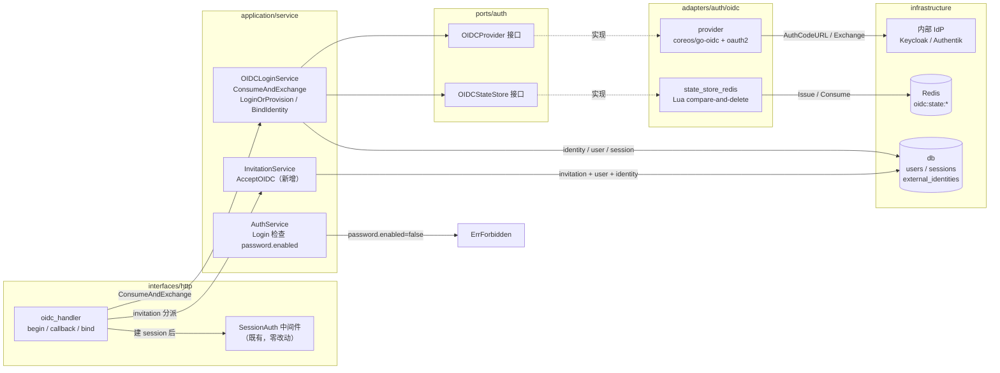
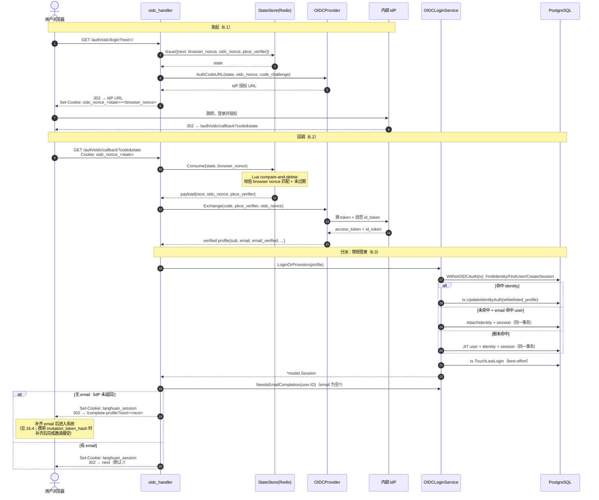
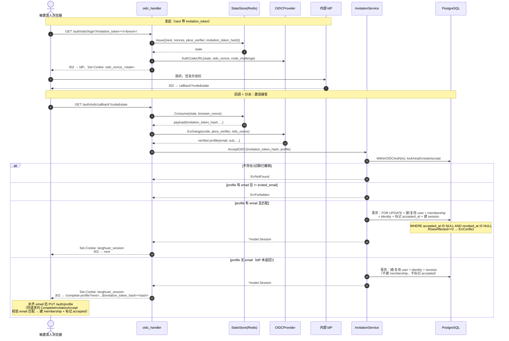
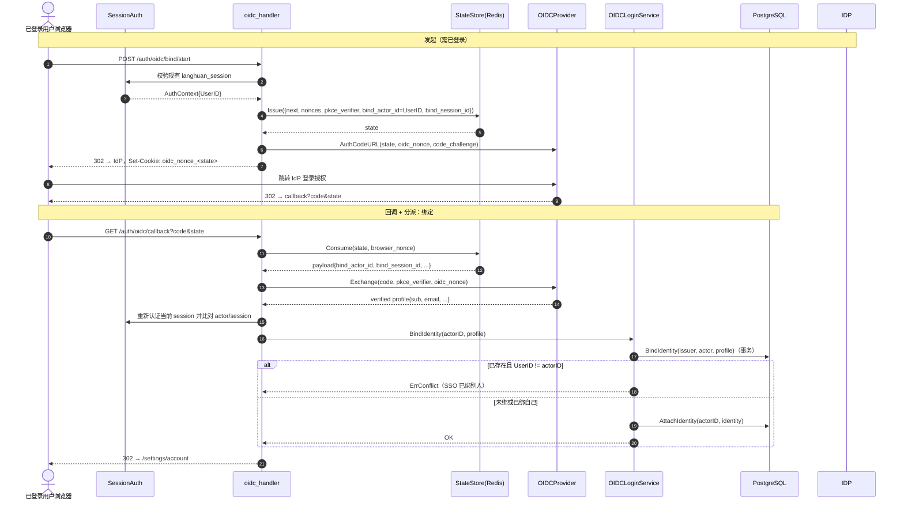
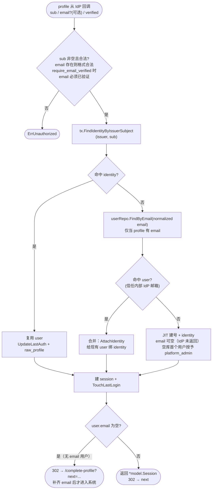
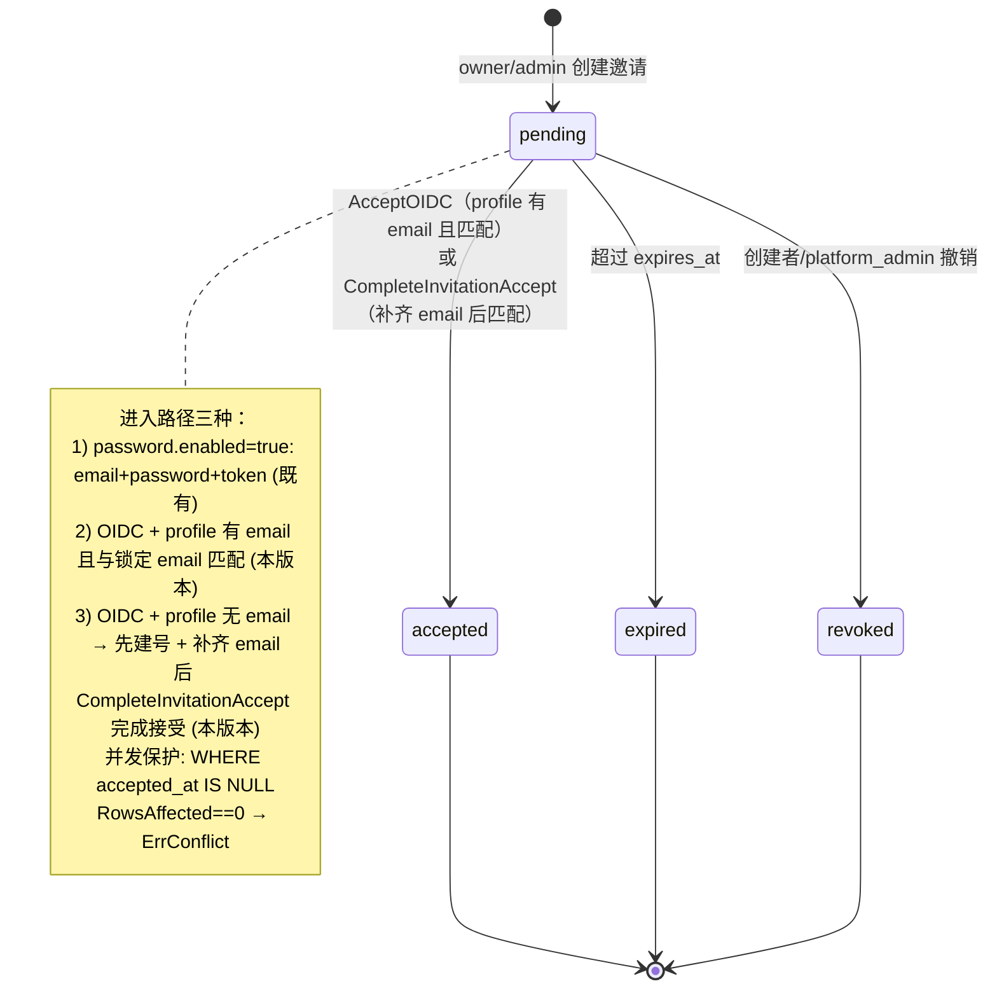
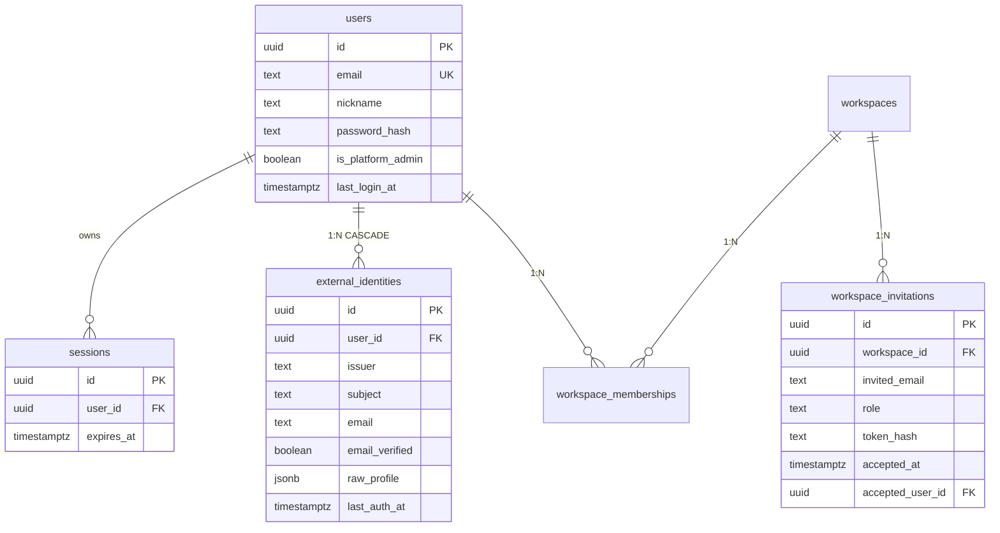

# 琅嬛 OIDC 接入设计规格（内部 IdP、OIDC-first）

## 1. 背景

琅嬛当前认证体系（v0.2.1 落地）只有两条通道：

- **浏览器 Session 主体**：email + password 登录，琅嬛自管 session（PostgreSQL 持久化 + httpOnly cookie）。
- **Workspace API Key 主体**：`Authorization: Bearer lhk_...`，仅用于 REST/MCP 程序化访问，不进入浏览器登录链路。

OIDC / SSO / 外部身份提供者在 v0.2.1 与 v0.6.0 的设计文档中均被**明确剔除**，原因是当时假想的是公共 IdP（飞书、Google 等），国内 IdP 未必能稳定拿到 email，且涉及通讯录同步问题。

本次接入的前提发生了变化：

- **琅嬛定位为个人或企业内部系统，一定不是公开 SaaS**。接入目标是**企业内部受控 IdP**（Keycloak / Authentik / 企业 Google Workspace / 自建 Dex 等），邮箱可信、可与企业通讯录一一对应。
- 企业内部部署普遍要求「身份统一收归 IdP」：收窄攻击面（密码不再散落在琅嬛进程内）、由 IdP 阻止后续登录、对接现有 SSO 体验。首版仍使用琅嬛本地 session，IdP 禁用账号不会主动撤销已经签发的本地 session。

在此前提下，OIDC 的历史顾虑（email 不可信、通讯录同步）不再成立。本版本交付 OIDC Authorization Code 登录，并支持 **OIDC-first 运行形态**：开启 OIDC 后可关闭运行期 password 登录，把人工登录入口统一收敛到 IdP。

> 本版本仍保留 password 通道作为独立开关（默认开），不做「开 OIDC 即强制关 password」的硬互斥。理由见第 3 节。API Key / MCP / Bearer 程序化访问路径完全不动。

## 2. 目标

本版本交付：

- Authorization Code flow（id_token 验签 + 可选 UserInfo 合并 claims），接入单个内部 IdP。
- `external_identities` 表记录 `(issuer, subject) → user` 绑定。首版只配置一个内部 issuer，不引入公共 IdP 或多 IdP 选择。
- OIDC 登录成功后**复用现有 session 模型**：建 session 行 + 写 httpOnly cookie，与 password 登录产出的 session 完全同构，`SessionAuth` 中间件零改动。
- 账号策略三种路径：复用已绑定 identity、按可信 email 合并到现有 user、对内部 IdP 的未知身份即时建号（JIT provisioning）。空库中的首个 OIDC 用户原子地成为 platform_admin；后续 JIT 用户不自动加入 workspace。
- **OIDC 接受邀请**：被邀请人通过 OIDC 登录，凭 `profile.Email == invitation.InvitedEmail` 接受邀请并加入 workspace，替代 OIDC-only 模式下失效的「email+password+token」接受路径。
- 已登录用户的**主动绑定**能力：本地 password 账号可在登录后绑定 OIDC（解绑首版不做）。
- 独立的 `auth.password.enabled` 运行期开关，支持 OIDC-first 形态。
- state 安全机制使用服务端 Redis 存储 + 浏览器 nonce cookie 双绑，一次性消费。

## 3. 非目标

本版本明确不做：

- **公共 IdP（Google / GitHub / 飞书等）接入**。本版本只服务于配置明确的企业内部或个人自建 issuer，不实现 provider 选择、公共 IdP 的邮箱归属策略或通讯录同步。
- refresh token、token rotation、SSO session bridging、跨域单点登出。
- 多 IdP 同时启用；首版只允许配置一个 issuer，且 identity 直接以 issuer + subject 标识。
- OIDC groups / role claim → workspace role 映射。
- 企业微信 / SAML / OAuth2（非 OIDC）。
- 解绑 identity、identity 合并 UI、跨 IdP identity 迁移工具。
- refresh_token 续期、id_token 缓存。
- IdP 禁用账号后的本地 session 反向撤销；首版只阻止新的 OIDC 登录，已有 session 按 `auth.session.lifetime_seconds` 到期或由管理员/用户撤销。
- 密码重置邮件自助流程。
- 前端「忘记密码」流程。
- 不受控的公开注册入口。OIDC JIT provisioning 只信任运维明确配置的内部/个人 issuer，能进入该 IdP 的用户即属于允许注册的内部身份；不增加任意 email+password 自由注册。
- 强制硬互斥（开 OIDC 即自动关 password）。`password.enabled` 与 `oidc.enabled` 是两个独立开关。

## 4. 关键决策

### 4.1 为什么不做「开 OIDC 即关 password」的硬互斥

硬互斥会撞上三个硬约束：

1. **Bootstrap 竞争**：空库同时允许 password 首注册和 OIDC JIT 注册，二者必须共享一个数据库级 bootstrap 临界区；第一个提交的用户成为唯一的 platform_admin，其余并发请求按普通 JIT 用户或注册冲突处理，不能靠事务外 `Count()==0` 判断。
2. **Invitation 流程断链**：现状邀请接受走 email+password+token。关 password 后必须改走 OIDC+email 匹配，这是一条绕不开的额外工作（本版本纳入，见第 8 节）。
3. **运维单点**：IdP 宕机 = 全员锁外。需要 break-glass 通道（通常是另一个 password 平台管理员）。

因此采用**两个独立开关**：

```yaml
auth:
  password:
    enabled: true   # 运行期 email+password 登录开关
  oidc:
    enabled: false
```

启动校验（fail fast）：
- `!oidc.enabled && !password.enabled` → 拒绝启动。
- `oidc.enabled=true` 但 `issuer` / `client_id` / `client_secret` / `redirect_url` 任一为空 → 拒绝启动。

三类部署形态都能表达：
- **全 OIDC（企业内部，推荐）**：`password.enabled=false, oidc.enabled=true`
- **并存（过渡/混合）**：两者都开
- **纯 password（现状）**：`oidc.enabled=false`

### 4.2 bootstrap 与首位管理员不变量

- 开启 OIDC 时，空库中的首个 OIDC JIT 用户成为 platform_admin，无需先创建本地密码账号。
- `RegisterFirstUser` 是 password bootstrap 路径：纯 password 或混合模式可用；当 `password.enabled=false` 时返回 `password_registration_disabled`，OIDC JIT 是唯一首用户入口。
- **所有会建新 user 的路径共享同一个 PostgreSQL advisory transaction lock**，事务内重新统计用户并决定 `is_platform_admin`，禁止在 service 层用 `Count()` + `Create()` 拼出非原子流程。必须持锁的路径清单：
  1. password `RegisterFirstUser`（既有首注册，混合模式）。
  2. OIDC `LoginOrProvision` 的 JIT 建号分支（§6.3）。
  3. OIDC `AcceptOIDC` 中「identity 与 email 均未命中、需新建 user」的分支（§6.4）。
- 既有 password `InvitationService.AcceptRegistration`（邀请接受，仅产生普通成员、不涉及 admin 判定）**不持锁**——它从不授予 platform_admin，不与 bootstrap 临界区竞争。
- 若任意两条建号路径并发，第一个持锁者成为 platform_admin；后续持锁者重读 `count > 0`，建普通用户。系统始终至少且只产生一个由 bootstrap 授予的 platform_admin。

推荐的基础设施实现顺序：

```sql
BEGIN;
SELECT pg_advisory_xact_lock(hashtextextended('langhuan:auth-bootstrap', 0));
SELECT count(*) FROM users;
-- count=0 时将本次创建的 user.is_platform_admin 设为 true，否则为 false
-- 创建 user、identity（如有）、session；提交时释放锁
COMMIT;
```

该锁只保护首用户判定，不需要在普通已初始化登录期间串行化所有请求；repository 应在事务内处理 `(issuer, subject)` 和 `users.email` 唯一键冲突，冲突后重读并按幂等规则返回。

### 4.3 OIDC 登录复用现有 session，不引入 ticket 中间层

琅嬛是 cookie session 模型（`AuthService.Login` 返回 `*model.Session`，handler `setSessionCookie` 写 cookie），不是 access token 模型。OIDC 登录成功后直接建 session + 写 cookie，复用现有 `SessionAuth` 中间件。**不学 agent-desk 的 login ticket 中间层**——那是 access token 模型下的产物，对琅嬛是多余的。

### 4.4 email 命中现有 user 时合并，不拒绝

这是与公共 IdP 假想的关键差异。内部 IdP 邮箱可信，`profile.Email` 命中现有 user 时**合并**（给该 user 建 `external_identity`），避免用户出现「本地账号」与「OIDC 账号」两套身份。合并后该 user 同时具备 password 登录（若 `password.enabled=true` 且有密码）与 OIDC 登录两条入口。

安全前提：issuer 由运维明确配置且不接受用户选择。`oidc.require_email_verified` 默认 `true`；只有确认内部 IdP 不提供 `email_verified`、但其邮箱目录仍由企业或个人完全控制时，运维才可显式设为 `false`。

**email 是可选字段**：IdP 出于隐私（email 视为敏感字段）可能不返回 email claim。此时允许创建无 email 的 OIDC 用户（JIT 建号 email 为空）。email 存在时必须格式合法；`require_email_verified=true` 时 email 必须已验证。无 email 用户无法通过邀请接受验证身份（邀请以 email 匹配为凭据），也无法 password 登录。

**无 email 用户先进系统、后补齐资料（complete-profile）**：OIDC 回调拿到无 email 的 profile 时，仍按正常流程建 user + identity + session（保证登录不被 IdP 字段裁剪阻断），随后 handler 检测 `user.email == ""`，302 到前端 `/complete-profile?next=<原目标>` 引导补齐 email。补齐是「先创建用户、后完善资料」，与「必须在进入 workspace 前拥有 email」的目标一致：

- email 补齐走 `PUT /auth/profile`（SessionAuth）：用户提交 email → `UpdateProfileEmail`（格式校验 + 唯一约束，重复返回 409）。
- 若登录时携带 `invitation_token_hash`（即原邀请接受流程），补齐 email 后在同一请求内调用 `CompleteInvitationAccept`：校验补齐后的 email 与邀请锁定 email 一致，一致才建 membership 并标记邀请 accepted；不一致返回 403，邀请保持 pending。
- 因此无 email 用户首次进入系统时一定被引导补齐 email；补齐后即拥有与其他用户一致的、可用于邀请匹配与展示的唯一 email。

### 4.5 state 用服务端 Redis 存储，不用 HMAC 自签

琅嬛已依赖 Redis（asynq 队列）。state 存 Redis、与浏览器一次性 nonce cookie 双绑，比纯 HMAC 自签 state 更稳：

- 可单实例失效（管理员清 Redis 即作废所有进行中的 OIDC 流程）。
- 天然一次性消费（Lua compare-and-delete：只有 browser nonce 匹配才删除），无需在应用层判重，也不会被错误 nonce 请求恶意消耗。
- nonce cookie 与 state 双绑，防 CSRF。

由于 state、OIDC nonce 和 PKCE verifier 全部保存在 Redis，浏览器只持有与具体 state 对应的随机 nonce cookie；nonce 被篡改时无法通过 Redis 比对。首版不再引入未实际使用的 `state_secret`，避免把“Redis state”与“自签 state”两套机制混在一起。

## 5. 架构增量

```text
HTTP 请求（OIDC 路径）
  -> GET /auth/oidc/login
       OIDCLoginService.BeginLogin
         -> stateStore.Issue({next, nonces, pkce_verifier}) -> {state}
         -> provider.AuthCodeURL(state, oidc_nonce, pkce_challenge)
       -> 302 到 IdP，set nonce cookie
  -> IdP 回调 GET /auth/oidc/callback?code=&state=
       读 nonce cookie
       OIDCLoginService.ConsumeAndExchange
         -> stateStore.Consume(state, nonceCookie) -> next
         -> provider.Exchange(code, pkce_verifier, expected_nonce) -> verified profile
         -> 按 state payload 分派：
              带 invitation_token_hash -> InvitationService.AcceptOIDC
              带 bind_actor_id     -> OIDCLoginService.BindIdentity
              否则                 -> 常规登录/建号/合并
         -> 建 session + setSessionCookie
       -> 302 到 next（默认 /）
  -> 此后所有请求走既有 SessionAuth 中间件，无任何特殊处理
```

worker 链路、API Key / MCP / Bearer 路径完全零改动。

新增或完善的代码边界：

```text
internal/
  domain/
    model/
      external_identity.go        # 新增：ExternalIdentity 领域模型
      user.go                     # 修改：NewProvisionalUser、HasPassword

  ports/
    auth/
      oidc.go                     # 新增：OIDCProvider、OIDCStateStore、OIDCProfile

  adapters/
    auth/
      oidc/                       # 新增子包
        provider.go               # coreos/go-oidc + oauth2 实现 OIDCProvider
        state_store_redis.go      # Redis 实现 OIDCStateStore

  application/
    service/
      oidc_login.go               # 新增：BeginLogin / ConsumeAndExchange / LoginOrProvision / BindIdentity
      invitation.go               # 修改：新增 AcceptOIDC 分支

  infrastructure/
    config/
      config.go                   # 修改：AuthConfig 增 OIDC、PasswordConfig 增 Enabled
    db/
      external_identity_rows.go   # 新增 ExternalIdentityRow + codec
      external_identity_repository.go # 只读当前用户 identity 摘要
      external_identity_repository.go  # 新增
      invitation_repository.go    # 既有 password 邀请接受；OIDC 事务由 oidc_auth_store 承担
      oidc_auth_store.go          # 新增：OIDCAuthTxRunner + tx-bound auth 持久化
    migrate/
      migrations/
        000019_external_identities.up.sql
        000019_external_identities.down.sql

  interfaces/
    http/
      router.go                   # 修改：挂 OIDC 路由（条件挂载）
      oidc_handler.go             # 新增：begin / callback / bind
      auth_handler.go             # 修改：login 在 password.enabled=false 时返回 403

cmd/
  langhuan/
    main.go                       # 装配 OIDC provider / state store / service

config.example.yaml               # 新增 auth.oidc 块、auth.password.enabled

web/                              # 登录页增 OIDC 入口、邀请页增 SSO 接受入口
```

依赖约束（严守 AGENTS.md 5.1 / 5.8）：

- `domain/model/external_identity.go` 不依赖 HTTP、数据库、Redis、OIDC SDK。
- `ports/auth/oidc.go` 只定义接口，不依赖 `coreos/go-oidc`（接口定义在使用方，实现在 adapter）。
- `application/service/oidc_login.go` 依赖 `ports/auth` 抽象与本地 repository 接口，不直接依赖 OIDC SDK 或 Redis SDK。
- `adapters/auth/oidc` 实现 port，封装 `coreos/go-oidc` 与 `go-redis`。
- HTTP handler 不直接访问数据库、Redis 或 IdP；只通过 service。
- **禁止包级全局变量**：不引入 `var OIDCLoginService = ...`、`var provider = ...`、`config.Current()` 等 agent-desk 式全局状态。全部构造函数注入。

### 5.1 组件依赖与数据流向



箭头实线表示运行期调用，虚线表示 port→adapter 的实现关系。三个 service（`OIDCLoginService` / `InvitationService` / `AuthService`）互相独立，由 handler 负责分派，避免循环依赖（见 §9.1）。OIDC 产出的 session 与 password 登录产出的 session 同构，`SessionAuth` 中间件不区分来源。

## 6. 认证流程

### 6.1 OIDC 登录发起（`GET /api/v1/auth/oidc/login`）

Query 参数：`next`（可选，登录后跳转路径，默认 `/`）。

流程：
1. `next = sanitizeNextPath(next)`：解析为 URL 后必须 `Scheme==""`、`Host==""`、路径以单个 `/` 开头；拒绝 `//`、反斜杠、控制字符、编码后再次解析为绝对 URL 的值。无法通过校验时返回 `ErrValidation`，不静默改写。
2. application service 使用 `crypto/rand` 生成 browser nonce、OIDC nonce、PKCE code_verifier，计算 S256 challenge；`stateStore.Issue(ctx, statePayload)` 把 `{browser_nonce, oidc_nonce, pkce_verifier, next, expiredAt, ...}` 写入 Redis（key = state，TTL = `state_ttl_seconds`，默认 300），返回 state。
4. `provider.AuthCodeURL(state, oidcNonce, codeChallenge)`：生成带 `nonce`、`code_challenge`、`openid profile email` 的 IdP 授权 URL。
5. 响应：`302` 到 IdP URL；设置与 state 绑定的 cookie `oidc_nonce_<state>=<browser_nonce>`，`HttpOnly; SameSite=Lax; Max-Age=300; Secure(生产)`。动态 cookie 名允许用户并发打开多个登录/邀请标签页。

state payload 结构（存 Redis value）：

```go
type oidcStatePayload struct {
    Next            string    `json:"next"`
    BrowserNonce    string    `json:"browser_nonce"`
    OIDCNonce       string    `json:"oidc_nonce"`
    PKCEVerifier    string    `json:"pkce_verifier"`
    InvitationTokenHash string `json:"invitation_token_hash,omitempty"` // sha256(token)
    BindActorID     uuid.UUID `json:"bind_actor_id,omitempty"`    // 来自已登录绑定
    BindSessionID   uuid.UUID `json:"bind_session_id,omitempty"`
    CreatedAt       time.Time `json:"created_at"`
}
```

### 6.2 OIDC 回调（`GET /api/v1/auth/oidc/callback`）

Query 参数：成功时为 `code`、`state`；用户取消或 IdP 拒绝时为 `error`、`state`。Cookie：`oidc_nonce_<state>`。

流程：
1. 按 state 读取 `oidc_nonce_<state>` cookie；对 state 长度和 base64url 字符集先做上限校验。
2. `stateStore.Consume(ctx, state, browserNonceCookie)`：
   - Redis Lua compare-and-delete 原子读取并仅在 nonce 匹配时删除 `oidc:state:<state>`；不存在/过期 → `ErrUnauthorized`。
   - 校验 `payload.BrowserNonce == browserNonceCookie`；使用常量时间比较，不匹配 → `ErrUnauthorized`。
   - 校验未过期。
   - 返回 `payload`。
3. 若回调带 `error`，消费 state 后映射为有限的本地错误码，**不透传 `error_description`**，清 cookie 并结束。映射规则：`access_denied`（用户拒绝授权或 IdP 拒绝）→ 稳定码 `oidc_access_denied`（HTTP 403）；其余 `error` 值（`invalid_request` / `server_error` / 未知值）统一归到 `oidc_provider_error`（HTTP 502）。两种情况都 `302 /login?oidc_error=<code>`。
4. `provider.Exchange(ctx, code, payload.PKCEVerifier, payload.OIDCNonce)`：
   - `oauth2.Exchange(code, code_verifier)` 换 token。
   - 取 `id_token`，`idTokenVerifier.Verify` 验签。
   - 显式校验 id_token `nonce == payload.OIDCNonce`；issuer/audience/expiry 由 verifier 校验。
   - `profileFromIDToken` 解析 `sub` / `email` / `email_verified` / `preferred_username` / `name` / `picture`。
   - 可选调用 UserInfo；UserInfo 的 `sub` 必须与 id_token `sub` 完全一致，且不得覆盖已经验证的 subject。只合并 whitelist 字段。
   - `sub` 为空 → `ErrUnauthorized`；email 存在但格式非法 → `ErrUnauthorized`；`require_email_verified=true` 且 email 存在但未验证 → `ErrUnauthorized`。email 缺失（IdP 不返回）**允许**，不拒绝。
5. 按 `payload` 分派（见 6.3 / 6.4 / 6.5）。
6. 所有成功和终态失败都清理本次 `oidc_nonce_<state>` cookie；成功登录才调用 `setSessionCookie`，绑定成功不替换现有 session。
7. 失败：`302` 到 `/login?oidc_error=<有限本地 code>`，不区分具体身份原因（防枚举）。

下面三张时序图覆盖发起→回调→分派的全链路。发起与回调阶段（6.1 / 6.2）对所有场景相同，差异只在回调里的分派（6.3 常规登录 / 6.4 邀请接受 / 6.5 绑定）。

#### 6.2.1 发起 + 常规登录全链路（6.1 + 6.2 + 6.3）



#### 6.2.2 邀请接受（6.4）



#### 6.2.3 已登录绑定（6.5）



### 6.3 常规登录/JIT 建号/合并（无 invitation_token_hash、无 bind_actor_id）

`OIDCLoginService.LoginOrProvision(ctx, profile, userAgent, ipAddr)`：

1. 校验 profile：`Subject` 非空；`Email` 存在时必须能通过领域 email 规范化；当 `oidc.require_email_verified=true` 且 email 存在时必须 `EmailVerified=true`。**email 允许为空**（IdP 可能不返回；见 §4.4）。
2. repository 在同一事务内按 `issuer + profile.Subject` 查找 identity：
   - 命中 → 复用 `identity.UserID`，刷新 `last_auth_at` / `raw_profile`。
3. identity 未命中时，若 profile 有 email，按规范化 email 查找现有 user：
   - repository `FindByEmail(profile.Email)`：
     - 命中 → **合并**：给该 user 建 `external_identity`（信任内部 IdP 邮箱）。
     - 未命中 → 走 JIT 建号。
   - profile 无 email → 跳过 email 合并，直接 JIT 建号（无 email 用户）。
4. JIT 建号：
   - `model.NewProvisionalUser(email, nickname)`：`password_hash=""`；email 可空。
   - `nickname` 从 `profile.Name` / `profile.PreferredUsername` / `profile.Subject` 派生。
   - 建 `external_identity` 指向新 user。
   - 不建 membership；只有邀请接受才加入 workspace。
   - 如果这是空库中的第一个用户，事务内将 `is_platform_admin=true`；否则为 false。
5. 建 session（`model.NewSession` + `sessionRepo.Create`），`TouchLastLogin`（best-effort）。
6. 返回 `(*model.Session, nil)`。handler 随后调 `NeedsEmailCompletion(user.ID)`：email 为空时 302 到 `/complete-profile?next=<next>`（并透传 `invitation_token_hash`），用户补齐 email 后才进入系统。

合并/JIT 建号的事务边界：`OIDCLoginService` 通过 `OIDCAuthTxRunner.WithinOIDCAuth` 获得 tx-bound 薄持久化接口，service 在事务回调内完成 identity/email 分支、bootstrap lock、用户创建/合并、identity 更新和 session 创建；service 不持有 `*gorm.DB`。session 与 user/identity 同一事务提交，避免认证成功但持久化不完整。

账号策略判定树（内部/个人 IdP，按 `require_email_verified` 校验）：



### 6.4 OIDC 接受邀请（state 带 invitation_token_hash）

`InvitationService.AcceptOIDC(ctx, invitationTokenHash, profile, userAgent, ipAddr)`：

1. 校验 profile 的 `sub`；email 存在时校验格式与 `email_verified` 策略（email 可空，见 §4.4）。
   `invitationTokenHash` 只接受 64 位小写 SHA-256 hex；格式不合法直接 `ErrUnauthorized`。
2. `invRepo.FindPendingByTokenHash(tokenHash)`：不存在/已过期/已接受/已撤销 → `ErrNotFound`（仅用于快速失败，不作为并发安全依据）。
3. profile 有 email 时，`normalizeEmail(profile.Email) == normalizeEmail(invitation.InvitedEmail)`？不匹配 → `ErrForbidden`（不泄漏 invitation 存在性，统一对外行为）。
   profile **无 email** 时跳过匹配（无法以 email 为凭据），见第 4 步的「补齐后完成接受」。
4. 事务内（`OIDCAuthTxRunner.WithinOIDCAuth`；第一步按 token_hash `FOR UPDATE` 重读 invitation）：
   - service 使用同一个 tx-bound store 按 `(issuer, subject)` 和规范化 email 查询。
   - identity 命中 → 复用其 user；identity 未命中但 email 命中现有 user → 给该 user 绑定 identity。
   - identity 与 email 分别命中两个不同 user → `ErrConflict`，不自动跨账号合并，交由管理员处理。
   - **均未命中 → 需新建 user：先 `AcquireBootstrapLock` 再 `CountUsers`（必须在锁内重读），`count==0` 时授予 platform_admin，否则普通用户；然后 `CreateUser` + `CreateIdentity`。** 这条路径与 §6.3 JIT、password 首注册共用同一把 advisory lock（见 §4.2 清单），保证 bootstrap 唯一性在「普通登录 + 邀请接受并发」下不被打破。
   - **profile 有 email（已与邀请 email 匹配）**：建 `membership`（`workspace_id` / `role` 取自 invitation），并按需要创建/刷新 `external_identity`；标记 invitation `accepted_at` / `accepted_user_id`（`WHERE accepted_at IS NULL AND revoked_at IS NULL`，`RowsAffected==0` 视为冲突）。
   - **profile 无 email**：只建 user + identity + session，**不建 membership、不标记 accepted**——邀请保持 pending，由 handler 引导用户先去 `/complete-profile` 补齐 email，补齐后 `CompleteInvitationAccept` 在同一请求内完成 membership 创建与 accepted 标记。
   - 建 session。
5. 返回 `(*model.Session, nil)`。

**CompleteInvitationAccept**（补齐 email 后的续接，由 `PUT /auth/profile` 在更新 email 成功后调用）：

`InvitationService.CompleteInvitationAccept(ctx, invitationTokenHash, userID)`：

1. 事务内 `FOR UPDATE` 重读 pending invitation；不存在/已接受/已撤销 → `ErrNotFound` / `ErrConflict`。
2. 读取当前 user：`user.Email` 为空 → `ErrValidation`（必须先有 email）。
3. `user.Email != invitation.InvitedEmail` → `ErrForbidden`（补齐的 email 必须与邀请锁定 email 一致）。
4. 建 `membership` + 标记 invitation `accepted_at` / `accepted_user_id`（同一事务）。
5. 不新建 session（沿用回调已建的 session）。

> OIDC-only 模式下（`password.enabled=false`），邀请接受只能走此路径；但内部 IdP 用户也可以先通过普通 OIDC JIT 注册，再通过邀请把已有账号加入 workspace。邀请链接 `/invitations/:token` 页面展示「用企业 SSO 接受邀请」按钮，点击跳 `/auth/oidc/login?invitation_token=<token>&next=/`。

邀请状态机（OIDC 接受复用既有状态机，仅新增进入路径，不改状态定义）：



### 6.5 已登录用户绑定 OIDC（`POST /api/v1/auth/oidc/bind/start`）

已登录（`SessionAuth`）用户主动绑定。流程：

1. 用户在前端点「绑定企业 SSO」→ `POST /auth/oidc/bind/start`（SessionAuth；现有 SameSite=Lax session cookie 不会随跨站 POST 发送）。
2. `BeginLogin` 时，从 `AuthContext.UserID` 和当前 session cookie 取 `bind_actor_id` / `bind_session_id` 写入 state payload。
3. 回调分派到 `OIDCLoginService.BindIdentity(actorUserID, profile)`：
   - 回调必须重新认证当前 session，并确认当前 user/session 与 state 中的 actor/session 完全一致；否则拒绝。
   - repository 在事务内按 `(issuer, profile.Subject)` 检查；已存在且 `identity.UserID != actorUserID` → `ErrConflict`（该 SSO 已绑别人）。
   - 否则 `AttachIdentity` 指向 `actorUserID`。
4. 成功后 `302` 到 `/settings/account`，展示已绑定状态。

### 6.6 password.enabled=false 时的入口矩阵

| 入口 | `password.enabled=true` | `password.enabled=false` |
|---|---|---|
| `POST /auth/login` | 正常 | `403 password_login_disabled` |
| `POST /auth/register`（无 token，count==0） | 正常（首注册） | `403 password_registration_disabled`；OIDC 首个 JIT 用户完成 bootstrap |
| `POST /auth/register`（无 token，count>0） | `409` | `403 password_registration_disabled` |
| `POST /auth/register`（带 token） | 正常（email+password 接受） | **停用**（invitation 走 OIDC 接受） |
| `POST /auth/password-reset` | 仅 platform_admin | 仅 platform_admin（break-glass 设密码） |
| `GET /auth/oidc/login` | 可用 | 可用（主入口） |
| OIDC 未知身份 JIT 注册 | 正常；空库首个用户为 platform_admin | 正常；空库首个用户为 platform_admin |
| OIDC 回调无 email | 先建号登录，302 `/complete-profile` 补齐 email | 同左（补齐后进系统） |
| 前端 `/login` | 密码框 + OIDC 按钮 | 只显示 OIDC 按钮 |
| 前端 `/invite/:token` | 密码注册表单 | 「用企业 SSO 接受邀请」按钮 |
| 前端 `/complete-profile` | 需要邮箱（补齐资料） | 需要邮箱（补齐资料） |

`password.enabled=false` 的约束必须由 application service 执行：除 `AuthService.Login` 外，既有 `InvitationService.Accept` 也必须返回稳定的 `password_registration_disabled`。不能只隐藏前端表单或只在 handler 判断。

### 6.7 break-glass

OIDC-first 模式下 IdP 宕机 = 全员锁外。break-glass 方案：

- 保留一个本地 password 的 platform_admin（部署时通过首注册创建，或通过 `password-reset` 维护）。
- 应急时运维修改 `config.yaml` 把 `password.enabled` 改回 `true` 并重启，该 admin 即可密码登录。OIDC discovery 为 lazy，IdP 不可达不会阻止服务启动；必要时也可临时设置 `oidc.enabled=false`。
- 不在代码里做自动 fallback（避免误开、避免审计盲区）。
- 当 `oidc.enabled=true` 且 password 登录成功时，日志记录 `auth_method=password, oidc_enabled=true`，供运维识别混合/应急登录；不使用无法从运行状态准确推断的 `break_glass=true` 标签。

## 7. 数据模型

### 7.1 external_identities 表（迁移 `000019`）

```sql
-- 000019_external_identities.up.sql
CREATE TABLE external_identities (
    id           uuid PRIMARY KEY DEFAULT gen_random_uuid(),
    user_id      uuid NOT NULL REFERENCES users(id) ON DELETE CASCADE,
    issuer       text NOT NULL,                 -- 首版只有一个运维配置的内部 issuer
    subject      text NOT NULL,                 -- IdP 的 sub claim
    email        text,                          -- 登录时刻快照；可为 NULL（IdP 不返回 email）
    email_verified boolean NOT NULL DEFAULT false,
    raw_profile  jsonb NOT NULL DEFAULT '{}'::jsonb, -- whitelist claims 快照，不保存完整 token claims
    last_auth_at timestamptz NOT NULL DEFAULT now(),
    created_at   timestamptz NOT NULL DEFAULT now(),
    updated_at   timestamptz NOT NULL DEFAULT now(),
    UNIQUE (issuer, subject),
    CONSTRAINT external_identities_issuer_nonempty CHECK (btrim(issuer) <> ''),
    CONSTRAINT external_identities_subject_nonempty CHECK (btrim(subject) <> '')
);
CREATE INDEX idx_external_identities_user_id ON external_identities(user_id);

-- 000020_optional_oidc_email.up.sql：放宽 email 为可空
ALTER TABLE users ALTER COLUMN email DROP NOT NULL;
ALTER TABLE external_identities ALTER COLUMN email DROP NOT NULL;
ALTER TABLE external_identities DROP CONSTRAINT IF EXISTS external_identities_email_nonempty;

-- 000019_external_identities.down.sql
DROP TABLE external_identities;
```

`(issuer, subject)` 全局唯一，指向唯一 user。首版只配置一个 issuer，但把 issuer 纳入唯一键，避免未来更换内部 IdP 时把不同 issuer 的同名 subject 错绑。

`users.email` 与 `external_identities.email` 均可为 NULL（迁移 000020 放宽）：OIDC IdP 出于隐私可能不返回 email。PostgreSQL 的 `users.email UNIQUE` 约束对 NULL 不生效，多个无 email 用户不冲突；非空 email 仍全局唯一。

本版本新增的表与既有认证表的关系：



`external_identities` 是本版本唯一新增表；`users` / `sessions` / `workspace_memberships` / `workspace_invitations` 均为既有（v0.2.1）。`users.password_hash` 空串语义（OIDC JIT 建号无密码账号）由领域层 `User.HasPassword()` 表达，不新增列。迁移 000020 放宽 `users.email` 为可空：OIDC profile 缺 email 时允许创建无 email 用户（领域层 `User.Email` 空串 = 无 email，落库为 NULL）。

`raw_profile` 只允许保存 `email`、`email_verified`、`preferred_username`、`name`、`picture` 五类归一化 claims；禁止保存完整 id_token、access_token、refresh_token、groups 或未审查的自定义 claims，并限制总大小（建议 16 KiB）。

### 7.2 users 表不改 schema

`password_hash` 已是 `text NOT NULL`，空串合法，OIDC 建的 provisional user `password_hash=""` 无需 schema 改动。

### 7.3 领域模型（`internal/domain/model/external_identity.go`）

```go
// ExternalIdentity 记录用户与内部 OIDC issuer 的绑定。
// (issuer, subject) 全局唯一，指向唯一 user。
type ExternalIdentity struct {
    ID         uuid.UUID
    UserID     uuid.UUID
    Issuer     string // 运维配置的 OIDC issuer
    Subject    string // IdP 的 sub claim
    Email      string // 登录时刻快照；可为空（IdP 不返回 email）
    EmailVerified bool
    RawProfile string // 经过 whitelist 的 claims JSON
    LastAuthAt time.Time
    CreatedAt  time.Time
    UpdatedAt  time.Time
}

// NewExternalIdentity 构造并校验：issuer/subject 非空，UserID 非 Nil。
// email 允许为空（IdP 可能不返回）；非空时 trim 存储。
func NewExternalIdentity(userID uuid.UUID, issuer, subject, email string, emailVerified bool, rawProfile string) (*ExternalIdentity, error)
```

不加 GORM / JSON tag（domain 保持干净，AGENTS.md 5.1 / 第 7 节）。

### 7.4 User 领域小幅扩展（`user.go`）

新增构造函数与方法：

```go
// NewProvisionalUser 创建无密码账号（如 OIDC JIT 建号）。
// password_hash 留空，表示该账号只能走外部 identity 登录。
func NewProvisionalUser(email, nickname string) (*User, error)

// HasPassword 报告该用户是否设有密码（能否走 password 登录）。
func (u User) HasPassword() bool
```

`login` 路径里，若 `!user.HasPassword()`，密码登录直接返回 `invalidLoginError`（与未知用户同样的错误，防枚举）。

## 8. Port（`internal/ports/auth/oidc.go`）

```go
// OIDCProvider 抽象内部 IdP 交互。接口定义在使用方（application/service），
// 实现在 adapters/auth/oidc。
type OIDCProvider interface {
    // AuthCodeURL 生成跳转 IdP 的授权 URL，同时发送 OIDC nonce 与 PKCE challenge。
    AuthCodeURL(state, oidcNonce, codeChallenge string) string
    // Exchange 用 code + PKCE verifier 换 token，验签并校验 id_token nonce，返回归一化 profile。
    Exchange(ctx context.Context, code, codeVerifier, expectedNonce string) (*OIDCProfile, error)
}

// OIDCProfile 是归一化后的 IdP 用户信息。
type OIDCProfile struct {
    Subject           string
    Email             string
    EmailVerified     bool
    PreferredUsername string
    Name              string
    Picture           string
    RawProfile        string // 经过 whitelist 的 claims JSON
}

// OIDCStateStore 管理 OIDC state 的下发与一次性校验。
type OIDCStateStore interface {
    // Issue 生成一次性 state，把 payload 写入 store，返回 state。
    // payload 中包含 OIDC nonce、PKCE verifier 与浏览器绑定 nonce。
    Issue(ctx context.Context, payload OIDCStatePayload) (state string, err error)
    // Consume 校验 state 有效、nonce 匹配、未过期、未重放；成功即删除。
    Consume(ctx context.Context, state, nonce string) (*OIDCStatePayload, error)
}

// OIDCStatePayload 是 state 在服务端存储的载荷。
type OIDCStatePayload struct {
    Next            string
    BrowserNonce    string
    OIDCNonce       string
    PKCEVerifier    string
    InvitationTokenHash string // 可选，避免把明文邀请 token 继续复制到 Redis
    BindActorID     uuid.UUID // 可选，来自已登录绑定
    BindSessionID   uuid.UUID // 绑定发起时的 session，回调时必须仍有效
}
```

> `state` 的生成/校验不放 `OIDCProvider`——state 是本地安全机制，由 application service 用 `OIDCStateStore` 管理。

## 9. Application Service

### 9.1 OIDCLoginService（`internal/application/service/oidc_login.go`）

```go
type OIDCLoginService struct {
    provider     authport.OIDCProvider
    stateStore   authport.OIDCStateStore
    authTx       OIDCAuthTxRunner // application 定义的事务合同
    identityReader ExternalIdentityReader // 只读列表，不参与事务决策
    sessionLife  time.Duration
    issuer       string
    requireEmailVerified bool
}

func NewOIDCLoginService(
    provider authport.OIDCProvider,
    stateStore authport.OIDCStateStore,
    authTx OIDCAuthTxRunner,
    identityReader ExternalIdentityReader,
    sessionCfg config.SessionConfig,
    oidcCfg config.OIDCConfig,
) *OIDCLoginService

// OIDCAuthTxRunner 由 application 定义、infrastructure/db 实现。
// 业务分支留在 service，runner 只建立事务并提供 tx-bound 薄持久化操作。
type OIDCAuthTxRunner interface {
    WithinOIDCAuth(ctx context.Context, fn func(tx OIDCAuthTx) error) error
}

type ExternalIdentityReader interface {
    ListByUserID(ctx context.Context, userID uuid.UUID) ([]*model.ExternalIdentity, error)
}

type OIDCAuthTx interface {
    AcquireBootstrapLock(ctx context.Context) error
    CountUsers(ctx context.Context) (int64, error)
    FindIdentityByIssuerSubject(ctx context.Context, issuer, subject string) (*model.ExternalIdentity, error)
    FindUserByID(ctx context.Context, id uuid.UUID) (*model.User, error)
    FindUserByEmail(ctx context.Context, email string) (*model.User, error)
    CreateUser(ctx context.Context, user *model.User) error
    CreateIdentity(ctx context.Context, identity *model.ExternalIdentity) error
    UpdateIdentityAuth(ctx context.Context, identity *model.ExternalIdentity) error
    CreateSession(ctx context.Context, session *model.Session) error
    TouchLastLogin(ctx context.Context, userID uuid.UUID) error // best-effort，失败不回滚认证
    FindActiveSession(ctx context.Context, sessionID uuid.UUID) (*model.Session, error)
    FindPendingInvitationForUpdate(ctx context.Context, tokenHash string) (*model.Invitation, error)
    CreateMembership(ctx context.Context, membership *model.Membership) error
    MarkInvitationAccepted(ctx context.Context, invitationID, userID uuid.UUID) error
}
```

`UserService.RegisterFirstUser` 同样通过该 runner（或语义等价的共享 bootstrap runner）执行 `AcquireBootstrapLock → CountUsers → CreateUser`，不能继续在事务外 `Count()` 再 `Create()`。OIDC JIT 使用同一把 advisory lock，保证两条 bootstrap 路径一致。

方法：

```go
// BeginLogin 生成 IdP 跳转 URL，返回 (authURL, browserNonce, state)。
// actorUserID/sessionID 非 Nil 时记入 state 用于绑定流程；invitationToken 非空时仅保存 hash。
func (s *OIDCLoginService) BeginLogin(ctx context.Context, next string, invitationToken string, actorUserID, sessionID uuid.UUID) (authURL, browserNonce, state string, err error)

// ConsumeAndExchange 取出一次性 state 并完成 OIDC code exchange。
func (s *OIDCLoginService) ConsumeAndExchange(ctx context.Context, code, state, browserNonce string) (*authport.OIDCStatePayload, *authport.OIDCProfile, error)

// LoginOrProvision 常规登录/JIT 建号/合并（6.3）。
func (s *OIDCLoginService) LoginOrProvision(ctx context.Context, profile *authport.OIDCProfile, userAgent, ipAddr string) (*model.Session, error)

// BindIdentity 已登录用户绑定 OIDC（6.5）。
func (s *OIDCLoginService) BindIdentity(ctx context.Context, actorUserID uuid.UUID, profile *authport.OIDCProfile) error

// ListIdentities 返回当前用户的非敏感外部身份摘要。
func (s *OIDCLoginService) ListIdentities(ctx context.Context, userID uuid.UUID) ([]*model.ExternalIdentity, error)

// NeedsEmailCompletion 判断用户是否缺少 email（OIDC 回调后 handler 据此
// 决定 302 到 /complete-profile 引导补齐）。
func (s *OIDCLoginService) NeedsEmailCompletion(ctx context.Context, userID uuid.UUID) (bool, error)
```

`LoginOrProvision` 的事务伪代码：

```text
validateProfile(profile)
authTx.WithinOIDCAuth(ctx, func(tx) {
    identity := tx.FindIdentityByIssuerSubject(issuer, profile.Subject)
    if identity found {
        user = tx.FindUserByID(identity.UserID)
        tx.UpdateIdentityAuth(identity, whitelistedProfile)
    } else {
        user = tx.FindUserByEmail(normalizedEmail(profile.Email))
        if user not found {
            tx.AcquireBootstrapLock()
            count = tx.CountUsers() // 必须在锁内重新统计
            user = NewProvisionalUser(...)
            user.IsPlatformAdmin = (count == 0)
            tx.CreateUser(user)
        }
        tx.CreateIdentity(NewExternalIdentity(user.ID, issuer, ...))
    }
    session = NewSession(user.ID, sessionLife, userAgent, ipAddr)
    tx.CreateSession(session)
    _ = tx.TouchLastLogin(user.ID)
    return nil
})
```

`BindIdentity` 使用同一个 `WithinOIDCAuth`，先在 tx 内通过 `FindActiveSession` 再次确认 `BindSessionID` 仍属于 `BindActorID`，只允许“未绑定”或“已绑定当前 actor”两种结果；不执行 email 合并、不改变 user email，也不替换当前 session。

回调分派逻辑：

```text
payload, profile := oidcLoginService.ConsumeAndExchange(code, state, browserNonce)

switch {
case payload.InvitationTokenHash != "":
    return invitationService.AcceptOIDC(ctx, payload.InvitationTokenHash, profile, userAgent, ipAddr), payload.Next
case payload.BindActorID != uuid.Nil:
    return oidcLoginService.BindIdentity(ctx, payload.BindActorID, profile), payload.Next
default:
    return oidcLoginService.LoginOrProvision(ctx, profile, userAgent, ipAddr), payload.Next
}
```

> 为避免 service 循环依赖，邀请/绑定/常规登录的分派由 **HTTP handler 层**做；state 消费和 token 校验仍封装在 `OIDCLoginService.ConsumeAndExchange` 中，handler 不直接依赖 Redis 或 OIDC SDK。

修订（避免 service 循环依赖）：`stateStore` 与 `provider` 注入到 handler 或由 handler 通过 `OIDCLoginService` 暴露的 `ConsumeAndExchange(ctx, state, nonce, code) (payload, profile, err)` 取回数据后分派。最终落地的依赖方向：

```text
http/oidc_handler
  -> OIDCLoginService.ConsumeAndExchange  (返回 payload + profile)
  -> if payload.InvitationTokenHash: InvitationService.AcceptOIDC(hash, profile)
  -> elif payload.BindActorID:    OIDCLoginService.BindIdentity(actorID, profile)
  -> else:                        OIDCLoginService.LoginOrProvision(profile)
```

三个 service 互相独立，handler 负责分派。

### 9.2 InvitationService 增 AcceptOIDC

```go
// AcceptOIDC 在 OIDC 回调中接受邀请（6.4）。
// 凭据是 invitation token hash + 已由 provider.Exchange 验证的 profile。
func (s *InvitationService) AcceptOIDC(
    ctx context.Context,
    invitationTokenHash string,
    profile *authport.OIDCProfile,
    userAgent, ipAddr string,
) (*model.Session, error)
```

`InvitationService` 从同一份 `AuthConfig.OIDC` 读取 issuer、`require_email_verified` 和 session lifetime，并调用 `OIDCAuthTxRunner.WithinOIDCAuth`。service 在事务回调内依次：按 token hash `FOR UPDATE` 重读 pending invitation；再次确认 profile email 与邀请 email 匹配（profile 无 email 时跳过匹配，只建 user/identity/session）；按 issuer+subject/email 决定复用、合并或 JIT 建号；处理 identity/email 冲突；有 email 时创建 membership 和 session，最后标记 invitation accepted。任何一步失败整体回滚。`InvitationRepository.AcceptRegistration` 继续只负责既有 password 邀请路径。

profile 无 email 时 `AcceptOIDC` 不建 membership、不标记 accepted，改由 `CompleteInvitationAccept` 在用户补齐 email 后（`PUT /auth/profile` 同一请求内）完成接受：

```go
// CompleteInvitationAccept 在用户补齐 email 后完成此前未完成的邀请接受（6.4）。
// 前提：当前 user 已有 email，且与邀请锁定 email 一致；否则 403。
func (s *InvitationService) CompleteInvitationAccept(
    ctx context.Context,
    invitationTokenHash string,
    userID uuid.UUID,
) error
```

因此 `InvitationService` 构造函数新增同一个 `OIDCAuthTxRunner` 依赖；`InvitationRepository` 仍保留既有 CRUD 和 password `AcceptRegistration`，不在 repository 内复制 OIDC 账号决策。

### 9.3 AuthService.login 检查 password.enabled

```go
func (s *AuthService) Login(ctx context.Context, email, password, userAgent, ipAddr string) (*model.Session, error) {
    if !s.passwordEnabled {
        return nil, domainerrors.ErrForbidden // password_login_disabled
    }
    // ...既有逻辑
}
```

`passwordEnabled` 由构造函数从 `config.Auth.Password.Enabled` 注入。`InvitationService.Accept` 也必须接收同一策略，关闭时拒绝 email+password 邀请注册。

## 10. Adapter（`internal/adapters/auth/oidc/`）

### 10.1 provider.go

- 库：`github.com/coreos/go-oidc/v3/oidc` + `golang.org/x/oauth2`（Go 社区标准实现）。
- 构造函数：

```go
// NewProvider 根据 config 构造 OIDCProvider。
// cfg.Enabled=false 时返回 (nil, nil)，调用方据此跳过装配。
//
// 返回 error 的唯一情形：配置非法（字段缺失、issuer/redirect URL 解析失败、
// 非 HTTPS 等，见 §12.3 validateAuth）。这些在 Validate 里已拦截，构造函数
// 只做防御性复核。**IdP 暂时不可达不视为配置错误**：构造函数不发起 discovery，
// 因此 IdP 宕机时 NewProvider 返回 (provider, nil)，琅嬛照常启动。
func NewProvider(ctx context.Context, cfg config.OIDCConfig) (*Provider, error)
```

- `cfg.Enabled=true` 时校验 `Issuer` / `ClientID` / `ClientSecret` / `RedirectURL` 非空（启动期 fail fast，配置不全直接启动失败）。生产环境要求 issuer/redirect URL 使用 HTTPS；仅 loopback 开发地址允许 HTTP。
- discovery 采用 lazy + bounded retry：构造时只记下 issuer/credentials，**不发起任何网络请求**；首次 `AuthCodeURL`/`Exchange` 触发 `.well-known/openid-configuration` 拉取（带 `http_timeout_seconds` 超时与有限重试）。discovery 失败时该次请求返回 `oidc_provider_unavailable`，但 password/break-glass、API Key、MCP 和 worker 继续可用。这与 §6.7 break-glass「IdP 不可达不阻止服务启动」一致。
- `scopes` 默认 `[openid, profile, email]`。
- `idTokenVerifier = p.Verifier(&gooidc.Config{ClientID: cfg.ClientID})`。
- `AuthCodeURL` 发送 OIDC nonce 与 PKCE S256 challenge。
- `Exchange`：`oauth2.Exchange(code_verifier)` → 取 `id_token` → `idTokenVerifier.Verify` → 校验 nonce → `profileFromIDToken` → 可选 UserInfo whitelist 合并。UserInfo `sub` 不一致时直接拒绝。
- 所有 discovery/token/UserInfo HTTP 调用使用配置化超时、响应体大小上限和请求 context；不记录 token 或原始响应。

### 10.2 state_store_redis.go

- 复用现有 `go-redis` 客户端（asynq 已用），构造函数注入 `*redis.Client`，**不引入包级全局**。
- `Issue`：
  - `state` 使用 `crypto/rand` 生成至少 32 字节随机数；其余 nonce/verifier 已由 application service 生成，state store 只负责原子存取。
  - payload JSON 序列化，`SET oidc:state:<state> <payload> EX <ttl>`。
  - 返回 state；browser nonce 由 service 写入 `oidc_nonce_<state>` cookie。
- `Consume`：
  - Redis Lua compare-and-delete（原子校验并删除，一次性消费）。
  - 不存在 → `ErrUnauthorized`。
  - browser nonce 常量时间比较；不匹配 → `ErrUnauthorized`。
  - 返回 payload。

## 11. HTTP 接口

### 11.1 路由（router.go，条件挂载）

```go
// 仅当 deps.OIDC != nil 时挂载
if deps.OIDC != nil {
    oidcH := oidcHandler{
        oidc:         deps.OIDC,
        invitations:  deps.Invitations,
        auth:         deps.Auth, // callback 绑定分支重新认证发起时 session
        sessionCfg:   deps.SessionConfig,
    }
    api.GET("/auth/oidc/login", oidcH.begin)     // public：普通登录/邀请接受
    api.GET("/auth/oidc/callback", oidcH.callback) // public
    authed.POST("/auth/oidc/bind/start", oidcH.beginBind) // SessionAuth
    authed.GET("/auth/external-identities", oidcH.listIdentities) // SessionAuth
}
```

`Dependencies` 新增 `OIDC OIDCLoginService`（接口，nil 时不挂路由）。

补齐邮箱接口挂在既有 auth 路由组（不随 OIDC 开关条件挂载，password 注册用户也可改邮箱）：

```go
authed.PUT("/auth/profile", authH.updateProfile) // SessionAuth：{email, invitation_token_hash?}
```

### 11.2 handler 行为

- `begin`：`GET /auth/oidc/login?next=&invitation_token=`，只用于普通登录和邀请接受；邀请 token 进入 state 前先计算 sha256，明文不写 Redis。
  - 调 `OIDCLoginService.BeginLogin` → 设本次 state 对应的动态 nonce cookie → `302`。
- `beginBind`：`POST /auth/oidc/bind/start`，挂在 `SessionAuth` 下；从当前 AuthContext 和 session cookie 取 actor/session 写入 state，再 `302` 到 IdP。不要用带副作用的 GET `?bind=1`。
- `callback`：`GET /auth/oidc/callback?code=&state=`。
  - 读 nonce cookie。
  - `ConsumeAndExchange` → `(payload, profile)`。
  - 按 payload 分派；若为绑定 payload，使用注入的 `AuthService.Authenticate` 重新认证当前 session，并比对 `BindActorID`/`BindSessionID`。
  - 登录/邀请接受成功建 session 后，调 `NeedsEmailCompletion(user.ID)`：
    - email 为空 → `setSessionCookie` + `302 /complete-profile?next=<next>`（邀请接受时额外带 `invitation_token_hash`）。
    - 有 email → `setSessionCookie` + `302 payload.Next`。
  - 失败：`302 /login?oidc_error=<code>`。
- 绑定回调自动分派到 `BindIdentity`；成功后只回 `/settings/account`，不替换已有 session。
- `PUT /auth/profile`（SessionAuth，auth_handler）：补齐邮箱。
  - body：`{"email": "...", "invitation_token_hash": "可选"}`。
  - `UpdateProfileEmail`（规范化 + 格式校验；`users.email UNIQUE` 冲突返回 409）。
  - body 带 `invitation_token_hash` 时继续调 `CompleteInvitationAccept`（补齐的 email 须与邀请锁定 email 一致，否则 403）。

### 11.3 外部身份查询

新增已登录接口 `GET /api/v1/auth/external-identities`，返回当前 user 的外部身份摘要：`issuer`、`email`、`email_verified`、`last_auth_at`。不返回 `subject`、`raw_profile` 或 identity 内部 ID。账号设置页用该接口展示绑定状态；`/auth/me` 不增加可选字段，避免认证方式信息在多个响应合同中漂移。

### 11.4 稳定错误码（沿用 v0.6.0 风格）

| HTTP | Code | 场景 |
|---:|---|---|
| 400 | `validation_error` | next 格式非法、bind 未登录 |
| 401 | `unauthorized` | state 不存在/过期/nonce 不匹配、id_token 验签失败、sub 为空 |
| 403 | `password_login_disabled` | `password.enabled=false` 时调 `/auth/login` |
| 403 | `password_registration_disabled` | `password.enabled=false` 时调 password 首注册或 password 邀请接受 |
| 403 | `forbidden` | invitation email 不匹配、补齐 email 与邀请锁定 email 不一致 |
| 403 | `oidc_access_denied` | IdP 回调带 `error=access_denied`（用户拒绝授权或 IdP 主动拒绝）；不透传 `error_description` |
| 409 | `conflict` | 绑定时 SSO 已绑别人、invitation 已接受、补齐 email 已占用 |
| 502 | `oidc_provider_unavailable` | discovery/IdP 暂时不可达 |
| 502 | `oidc_provider_error` | token endpoint/UserInfo 失败（不泄漏 IdP 细节） |

OIDC 回调失败统一 `302 /login?oidc_error=<code>`，不返回 JSON（因为是浏览器流程）。

## 12. 配置

### 12.1 config.go 变更

`AuthConfig` 增 `OIDC`，`PasswordConfig` 增 `Enabled`：

```go
type AuthConfig struct {
    Session    SessionConfig    `yaml:"session"`
    Password   PasswordConfig   `yaml:"password"`
    RateLimit  RateLimitConfig  `yaml:"rate_limit"`
    Invitation InvitationConfig `yaml:"invitation"`
    OIDC       OIDCConfig       `yaml:"oidc"` // 新增
}

type PasswordConfig struct {
    Argon2MemoryKiB   uint32 `yaml:"argon2_memory_kib"`
    Argon2Iterations  uint32 `yaml:"argon2_iterations"`
    Argon2Parallelism uint8  `yaml:"argon2_parallelism"`
    Enabled           bool   `yaml:"enabled"` // 新增
}

type OIDCConfig struct {
    Enabled         bool     `yaml:"enabled"`
    Issuer          string   `yaml:"issuer"`
    ClientID        string   `yaml:"client_id"`
    ClientSecret    string   `yaml:"client_secret"`
    RedirectURL     string   `yaml:"redirect_url"`
    Scopes          []string `yaml:"scopes"`           // 空则默认 [openid, profile, email]
    RequireEmailVerified bool `yaml:"require_email_verified"` // 默认 true
    StateTTLSeconds int      `yaml:"state_ttl_seconds"` // 默认 300
    HTTPTimeoutSeconds int   `yaml:"http_timeout_seconds"` // 默认 10
}
```

### 12.2 `password.enabled` 默认值兼容（易踩坑）

当前加载流程先执行 `defaultConfig()`，再把 YAML unmarshal 到已有值。因此 `Enabled` 保持普通 `bool` 即可：在 `defaultAuthConfig()` 中设置 `Password.Enabled=true`、`OIDC.RequireEmailVerified=true`；旧配置未写字段时保留默认值，显式写 `false` 时正确覆盖。无需引入 `*bool`。

### 12.3 validateAuth 增量

```go
func (c *Config) validateAuth() error {
    // ...既有校验

    if !c.Auth.Password.Enabled && !c.Auth.OIDC.Enabled {
        return errors.New("auth.password.enabled 与 auth.oidc.enabled 不能同时为 false")
    }
    if c.Auth.OIDC.Enabled {
        if strings.TrimSpace(c.Auth.OIDC.Issuer) == "" {
            return errors.New("auth.oidc.enabled=true 时 issuer 不能为空")
        }
        if strings.TrimSpace(c.Auth.OIDC.ClientID) == "" {
            return errors.New("auth.oidc.enabled=true 时 client_id 不能为空")
        }
        if strings.TrimSpace(c.Auth.OIDC.ClientSecret) == "" {
            return errors.New("auth.oidc.enabled=true 时 client_secret 不能为空")
        }
        if strings.TrimSpace(c.Auth.OIDC.RedirectURL) == "" {
            return errors.New("auth.oidc.enabled=true 时 redirect_url 不能为空")
        }
        issuerURL, err := url.Parse(c.Auth.OIDC.Issuer)
        if err != nil || issuerURL.Scheme == "" || issuerURL.Host == "" || issuerURL.User != nil {
            return errors.New("auth.oidc.issuer 必须是无用户信息的绝对 URL")
        }
        redirectURL, err := url.Parse(c.Auth.OIDC.RedirectURL)
        if err != nil || redirectURL.Scheme == "" || redirectURL.Host == "" || redirectURL.User != nil {
            return errors.New("auth.oidc.redirect_url 必须是无用户信息的绝对 URL")
        }
        if redirectURL.Path != "/api/v1/auth/oidc/callback" {
            return errors.New("auth.oidc.redirect_url 必须指向 /api/v1/auth/oidc/callback")
        }
        if c.Auth.OIDC.StateTTLSeconds <= 0 {
            return errors.New("auth.oidc.state_ttl_seconds 必须大于 0")
        }
        if c.Auth.OIDC.HTTPTimeoutSeconds <= 0 {
            return errors.New("auth.oidc.http_timeout_seconds 必须大于 0")
        }
    }
    return nil
}
```

### 12.4 config.example.yaml 增量

```yaml
auth:
  password:
    enabled: true  # 运行期 email+password 登录开关；false 时 /auth/login 返回 403。默认 true（向后兼容）
    # ...既有 argon2 参数
  oidc:
    enabled: false        # 默认关闭；企业内部部署建议开启并配合 password.enabled=false
    issuer: ""            # 如 https://sso.example.com/realms/corp
    client_id: ""
    client_secret: ""
    redirect_url: ""      # 如 https://langhuan.example.com/api/v1/auth/oidc/callback
    require_email_verified: true # 推荐保持 true；仅受控 IdP 确实不提供该 claim 时显式关闭
    state_ttl_seconds: 300
    http_timeout_seconds: 10
    scopes: []            # 空则默认 [openid, profile, email]
```

## 13. 装配（cmd/langhuan/main.go）

伪代码：

```go
oidcProvider, err := oidcadapter.NewProvider(ctx, cfg.Auth.OIDC)
if err != nil {
    // 仅配置非法时返回 error（字段缺失、URL 非法）。
    // IdP 不可达不会走到这里——构造时不 discovery，见 §10.1。
    return err
}
var oidcLoginSvc *service.OIDCLoginService
if oidcProvider != nil { // cfg.Auth.OIDC.Enabled=true
    stateStore := oidcadapter.NewRedisStateStore(redisClient, cfg.Auth.OIDC)
    oidcLoginSvc = service.NewOIDCLoginService(
        oidcProvider, stateStore,
        db.NewExternalIdentityRepository(db),
        userRepo, sessionRepo,
        cfg.Auth.Session,
    )
}
routerDeps.OIDC = oidcLoginSvc // nil 时 router 不挂 oidc 路由
```

`AuthService` 注入新增 `passwordEnabled` 参数（从 `cfg.Auth.Password.Enabled` 取）。

## 14. 安全约束

| 点 | 措施 |
|---|---|
| state CSRF | 服务端 Redis 存储 + 浏览器 nonce cookie 双绑，Lua compare-and-delete 一次性消费 |
| open redirect | `next` 只允许无 scheme/host 的站内绝对路径；拒绝 `//`、反斜杠、控制字符和编码变体 |
| id_token 篡改 | `coreos/go-oidc` 内置验签（基于 issuer JWKS） |
| 账号劫持 | 只接受运维配置的内部/个人 issuer；email 可选（IdP 可能不返回），存在时默认要求 `email_verified=true`；identity 以 issuer+sub 为准，已绑定 identity 不因 email 变化自动换绑 |
| bootstrap 首管理员安全性 | 空库首个 OIDC JIT 用户直接成为 platform_admin，**该安全性继承自 IdP 准入策略**：部署者须确保 IdP realm/客户端不允许公开自助注册、client_secret 不外泄、可登录账号仅限受信任成员。该门槛取代了 password 首注册「知道部署地址即可」的弱门槛；若 IdP realm 误开自助注册，第一个登录者即拿走 platform_admin，无审批环节 |
| 枚举 | OIDC 失败统一 `302 /login?oidc_error`，不区分「用户不存在」「sub 未绑」「验签失败」 |
| rate limit | callback 路径复用 `RateLimiter`，key 用 `oidc:rl:<ip>`，限制每 IP 每分钟 N 次（防 IdP 探测） |
| 日志脱敏 | `sub` / `email` 是 PII；日志只记 `auth_method=oidc, user_id=..., action=login_ok\|login_fail`，不打 `raw_profile` / `id_token` / `access_token` |
| session 不降级 | OIDC 路径产出的 session 与 password 登录 session 完全同构，`SessionAuth` 中间件无需改动 |
| OIDC nonce/PKCE | 授权请求发送 nonce + S256 PKCE；回调验证 id_token nonce，并以 code_verifier 换 token |
| invitation email 匹配 | `profile.Email` 与 `invitation.InvitedEmail` 都走 `normalizeEmail`（trim+lower），避免大小写差异绕过 |
| invitation 一次性 | invitation_token 写进 state，state 在 Redis 一次性消费；invitation 接受后 `accepted_at` 置位，`WHERE accepted_at IS NULL` 防并发重放 |
| break-glass 审计 | OIDC 开启期间的 password 登录记录 `oidc_enabled=true`；应急切换通过显式配置变更和重启完成 |

## 15. 测试策略（严守 AGENTS.md 5.10）

### 15.1 单元测试（service）

mock `OIDCProvider` / `OIDCStateStore` / repos，表驱动覆盖：

- **LoginOrProvision**：
  - `(issuer, sub)` 已绑 → 复用，刷新 `last_auth_at`。
  - sub 未绑，email 命中现有 user → 合并，建 identity，不建新 user。
  - sub 未绑，email 未占用 → JIT 建 provisional user + identity。
  - sub 未绑且 email 缺失（IdP 不返回）→ JIT 建无 email 用户，不与现有用户合并。
  - 空库首个 OIDC 用户 → 唯一 platform_admin；两个并发首登录只能有一个获得该角色。
  - sub 缺失、email 存在但格式非法、或满足 email 存在但未达 email_verified 策略 → `ErrUnauthorized`。
- **stateStore**：state 过期、不存在、browser nonce 不匹配 → `ErrUnauthorized`；一次性消费；并发多个 state 的动态 nonce cookie 互不覆盖。
- **AcceptOIDC**：
  - email 匹配 → 建 user + membership + identity + 标记 invitation，事务一致。
  - email 不匹配 → `ErrForbidden`。
  - **profile 无 email → 只建 user + identity + session，不建 membership、不标记 invitation**；随后 `CompleteInvitationAccept`（补齐 email 后）校验 email 一致才完成接受；不一致 → `ErrForbidden`、邀请保持 pending。
  - invitation 已接受 → `ErrConflict`。
  - invitation 不存在/过期 → `ErrNotFound`。
- **UpdateProfileEmail / CompleteInvitationAccept**：补齐 email 格式非法 → `ErrValidation`；邮箱已占用 → 409（DB 唯一约束）；补齐 email 与邀请锁定 email 不一致 → `ErrForbidden`。
- **NeedsEmailCompletion**：无 email 用户返回 true，有 email 返回 false。
- **BindIdentity**：
  - `(issuer, sub)` 未绑且当前 session 与 state 一致 → 成功。
  - 已绑别人 → `ErrConflict`。
  - 已绑自己 → 幂等成功。
  - 回调时 session 已撤销、切换用户或 session id 不同 → `ErrUnauthorized`。
- **password 开关**：`AuthService.Login` 在关闭时拒绝；`InvitationService.Accept` 同样拒绝密码邀请注册；`RegisterFirstUser` 仅在 password 开启时作为 bootstrap，OIDC 开启且 password 关闭时由 OIDC JIT 完成 bootstrap。

参考 `auth_test.go` 的 fake repository 风格。

### 15.2 单元测试（adapter）

- `provider.Exchange` 用 `httptest.Server` 伪装 IdP：
  - `.well-known/openid-configuration` + token endpoint + JWKS endpoint。
  - 签发用测试私钥的 id_token，验证验签成功 / 篡改失败 / `id_token` 缺失。
  - OIDC nonce 与 PKCE 成功路径；nonce 不匹配、code_verifier 错误均拒绝。
  - UserInfo endpoint 只合并 whitelist claims，且 UserInfo `sub` 不同必须拒绝。
- `state_store_redis`：用 `miniredis`（参考 `redis_rate_limiter_test.go` 的 `newMiniRateLimiter` 风格），覆盖 Issue/Consume/一次性/TTL。

### 15.3 集成测试（repository）

- `000019_external_identities` + `000020_optional_oidc_email` 迁移：从空库执行成功，schema / 约束 / 索引正确；无 email 用户落库为 NULL。
- `OIDCAuthTxRunner.WithinOIDCAuth`：覆盖 LoginOrProvision、AcceptOIDC、BindIdentity 的 identity/email 唯一键竞态。
- `(issuer, subject)` 唯一约束：重复插入失败。
- OIDC invitation transaction：成功提交 / 中途失败回滚 / 并发接受 `RowsAffected==0`。
- **bootstrap advisory lock 并发矩阵**（§4.2 持锁路径清单全覆盖）：空库下两两并发，只产生一个 bootstrap platform_admin：
  - password 首注册 × OIDC JIT 首登录。
  - OIDC JIT 首登录 × OIDC 邀请接受新建 user。
  - password 首注册 × OIDC 邀请接受新建 user。
  - 三路同时并发（用 `errgroup` 起三个 goroutine）。
  - 已初始化库（count>0）下，JIT 与邀请接受并发均建普通用户、无 admin 提升。
- **走临时 docker pgvector 容器**（`LANGHUAN_TEST_DATABASE_DSN`），严禁连 `config.yaml` 的库。

### 15.4 集成测试（config）

- 升级兼容：旧 `config.yaml`（无 `password.enabled` 字段）加载后默认 true，不锁死。
- fail-fast：`!password.enabled && !oidc.enabled` → 启动报错。
- `oidc.enabled=true` 缺字段 → 启动报错。

### 15.5 e2e

在 `cmd/langhuan/*_e2e_test.go` 加 `oidc_flow_e2e_test.go`，启 `httptest` IdP，跑全链路：
- 常规登录：begin → callback → `/auth/me` 返回新 user。
- 空库首个 OIDC JIT 用户：返回 platform_admin；第二个未知 OIDC 用户无 membership 且不是 platform_admin。
- password 首注册与 OIDC 首登录并发：只产生一个 bootstrap platform_admin。
- 邀请接受：创建 invitation → 带 token 走 OIDC → 校验 user / identity / membership / `invitation.accepted_at` 事务一致。
- email 合并：预置 password user → OIDC 回调同 email → 只增 identity 不建新 user。
- 绑定：登录 → bind → `/auth/external-identities` 返回当前 issuer 摘要。

## 16. 前端交互

前端复用并扩展 `GET /api/v1/auth/bootstrap-status`，固定返回 `initialized`、`password_enabled`、`oidc_enabled`，据此决定显示哪些入口；不再新增含义重叠的 `/auth/config`。三个关键页面的形态随配置组合切换。

### 16.1 登录页（`web/src/routes/login.tsx`）

三种形态：OIDC-only（企业内部推荐）、并存、首注册（bootstrap，根据启用的通道提供入口）。

**形态 A：OIDC-only（`password.enabled=false, oidc.enabled=true`）**

```
┌──────────────────────────────────────────┐
│                                            │
│                  琅嬛                       │
│                                            │
│         ┌────────────────────────┐         │
│         │  用企业 SSO 登录        │         │
│         └────────────────────────┘         │
│                                            │
│      登录将跳转至企业身份提供者             │
│                                            │
└──────────────────────────────────────────┘
```

**形态 B：并存（`password.enabled=true, oidc.enabled=true`）**

```
┌──────────────────────────────────────────┐
│                                            │
│                  琅嬛                       │
│                                            │
│         邮箱  [____________________]       │
│         密码  [____________________]       │
│                                            │
│         ┌────────────────────────┐         │
│         │       登录              │         │
│         └────────────────────────┘         │
│                                            │
│            ─────── 或 ───────              │
│                                            │
│         ┌────────────────────────┐         │
│         │  用企业 SSO 登录        │         │
│         └────────────────────────┘         │
│                                            │
└──────────────────────────────────────────┘
```

**形态 C：首注册 bootstrap（`initialized=false`）**

```
┌──────────────────────────────────────────┐
│            首次部署 · 创建管理员           │
│                                            │
│         邮箱     [____________________]    │
│         昵称     [____________________]    │
│         密码     [____________________]    │
│                                            │
│         ┌────────────────────────┐         │
│         │       创建管理员         │         │
│         └────────────────────────┘         │
│                                            │
│  首个成功注册的用户成为 platform_admin        │
└──────────────────────────────────────────┘
```

逻辑规则：
- `oidc_enabled=true`：显示「用企业 SSO 登录」按钮，点击 `window.location = /api/v1/auth/oidc/login?next=<returnTo>`。
- `password_enabled=true`：显示密码登录表单（现状）。
- OIDC-only：隐藏密码表单。
- bootstrap（`initialized=false`）：若 OIDC 开启，显示「用企业 SSO 创建管理员」；若 password 开启，显示本地密码首注册表单。两条路径共享数据库 bootstrap lock，先成功者成为唯一 platform_admin。

### 16.2 邀请页（`web/src/routes/invite/:token`）

邀请页展示邀请信息（workspace 名、角色、锁定 email），下方接受入口随可用认证方式显示。

**`password.enabled=true`（密码注册表单，OIDC 开启时同时提供 SSO）**

```
┌──────────────────────────────────────────┐
│            接受工作区邀请                   │
│                                            │
│  工作区    Acme 知识库                      │
│  角色      成员 (member)                    │
│  邮箱(锁定) bob@acme.com                    │
│                                            │
│  昵称     [____________________]            │
│  密码     [____________________]            │
│                                            │
│  ┌────────────────────────┐                │
│  │     接受邀请并注册       │                │
│  └────────────────────────┘                │
└──────────────────────────────────────────┘
```

当 `oidc.enabled=true` 时，密码入口旁同时显示「用企业 SSO 接受邀请」；两条路径最终都进入同一个 pending/accepted 邀请状态机，OIDC 路径使用 `OIDCAuthTxRunner`，password 路径使用既有 `AcceptRegistration`。

**`password.enabled=false`（OIDC 接受）**

```
┌──────────────────────────────────────────┐
│            接受工作区邀请                   │
│                                            │
│  工作区    Acme 知识库                      │
│  角色      成员 (member)                    │
│  邮箱(锁定) bob@acme.com                    │
│                                            │
│  ┌────────────────────────┐                │
│  │  用企业 SSO 接受邀请     │                │
│  └────────────────────────┘                │
│                                            │
│  将跳转至企业 IdP，需以锁定邮箱登录          │
└──────────────────────────────────────────┘
```

按钮跳 `/api/v1/auth/oidc/login?invitation_token=<token>&next=/`。回调分派：

- profile 有 email 且与锁定 email 一致 → 直接接受邀请，302 到 next。
- profile 有 email 但不一致 → 后端返回 `forbidden`，前端提示「IdP 邮箱与邀请邮箱不一致」，邀请保持 pending。
- profile 无 email（IdP 未返回）→ 先建号登录，302 到 `/complete-profile?next=...&invitation_token_hash=<hash>`；用户补齐 email 且与锁定 email 一致后完成接受；不一致则 403（邀请保持 pending，可换邮箱重试）。

### 16.3 账号设置（`web/src/routes/settings/account`）

展示当前 user 已绑定的外部身份，并提供绑定入口。

```
┌──────────────────────────────────────────┐
│  账号设置                                   │
├──────────────────────────────────────────┤
│  基本信息                                   │
│  邮箱      ada@acme.com                     │
│  昵称      Ada Lovelace                     │
│                                            │
│  外部身份 (SSO)                             │
│  ┌──────────────────────────────────────┐  │
│  │ OIDC  ada@acme.com                    │  │
│  │ 上次登录 2026-08-07 09:12              │  │
│  └──────────────────────────────────────┘  │
│                                            │
│  ┌────────────────────────┐                │
│  │     绑定企业 SSO        │                │
│  └────────────────────────┘                │
│                                            │
│  密码                                       │
│  ┌────────────────────────┐                │
│  │      修改密码            │                │
│  └────────────────────────┘                │
└──────────────────────────────────────────┘
```

- 「已绑定的外部身份」区域：展示当前 user 的 `external_identities` 列表（issuer / email / last_auth_at）。
- 「绑定企业 SSO」按钮 → POST `/api/v1/auth/oidc/bind/start`。
- 绑定流程：已登录用户点按钮 → 跳 IdP → 回调重新认证原 session → 分派到 `BindIdentity` → 成功回到此页刷新列表。若该 SSO 已绑别人，提示冲突。
- 解绑首版不做。

### 16.4 补齐资料页（`web/src/routes/complete-profile`，auth 保护）

OIDC 回调成功但 IdP 未返回 email 时，后端 302 到本页引导补齐 email（见 §6.2.1 / §6.2.2 无 email 分支）。该页面要求已登录（session cookie 已下发），未登录访问跳回 `/sign-in`。

```
┌──────────────────────────────────────────┐
│                  琅嬛                       │
│                                            │
│            补齐邮箱以继续                     │
│  企业 SSO 未提供邮箱，请补充资料。            │
│                                            │
│         邮箱  [____________________]       │
│                                            │
│  ┌────────────────────────┐                │
│  │        保存并继续         │                │
│  └────────────────────────┘                │
│                                            │
│  邮箱仅用于展示与邀请匹配，可稍后在账号设置修改  │
└──────────────────────────────────────────┘
```

- 表单：React Hook Form + Zod（email 必填、格式校验），提交 `PUT /auth/profile`。
- URL 参数：`next`（原登录目标，默认 `/workspaces`）、`invitation_token_hash`（登录携带邀请时透传；补齐 email 后同一请求完成邀请接受）。
- 成功后 `resetUnauthorizedNavigation()` + 刷新 `/auth/me` 缓存，跳 `next`。
- 错误：409 →「邮箱已被占用」；403 →「邮箱与邀请不一致」；其余展示后端消息。

## 17. 对现有代码的影响

### 17.1 需修改

- `internal/domain/model/user.go`：新增 `NewProvisionalUser` / `HasPassword`；email 可空。
- `internal/application/service/auth.go`：`Login` 检查 `passwordEnabled`；构造函数增参数。
- `internal/application/service/user.go`：`RegisterFirstUser` 增加 password-enabled 判断；首用户创建改为与 OIDC JIT 共用 bootstrap advisory lock 的原子 repository 合同；新增 `UpdateProfileEmail`（补齐邮箱）。
- `internal/application/service/invitation.go`：新增 `AcceptOIDC` / `CompleteInvitationAccept` 方法。
- `internal/application/service/oidc_login.go`：新增 `NeedsEmailCompletion`。
- `internal/infrastructure/config/config.go` / `config_test.go`：`AuthConfig` 增 `OIDC`，`PasswordConfig` 增 `Enabled`；在 `defaultConfig()` 中设置兼容默认值，`validateAuth` 增量。
- `internal/infrastructure/db/external_identity_rows.go`：新增 `ExternalIdentityRow` + domain codec。
- `internal/infrastructure/db/oidc_auth_store.go`：实现 `OIDCAuthTxRunner` 与 tx-bound auth 持久化操作；既有 `invitation_repository.go` 不承担 OIDC 业务决策。
- `internal/infrastructure/db/user_repository.go`：`UserRow.Email` 改 `*string`，新增 `UpdateEmail`。
- `internal/infrastructure/migrate/migrations/`：新增当前序列后的 `000019`（external_identities）与 `000020`（email 可空）。
- `internal/interfaces/http/router.go`：`Dependencies` 增 `OIDC`；条件挂载 OIDC 路由；`authed.PUT("/auth/profile", ...)`。
- `internal/interfaces/http/auth_handler.go`：`login` 在 `password.enabled=false` 时由 service 返回 `ErrForbidden`，handler 映射 403；新增 `updateProfile` handler。
- `internal/interfaces/http/oidc_handler.go`：回调成功分派；无 email 时 302 `/complete-profile`。
- `internal/interfaces/http/auth_handler.go`：`bootstrap-status` 增加 `password_enabled` / `oidc_enabled`；OIDC callback 的绑定分支重新认证发起时 session。
- `internal/interfaces/http/oidc_handler.go`：增加 `GET /auth/external-identities` 非敏感摘要接口。
- `cmd/langhuan/main.go`：装配 OIDC provider / state store / service；`AuthService` 注入 `passwordEnabled`。
- `config.example.yaml`：新增 `auth.oidc` 块、`auth.password.enabled`。
- `web/src/routes/login.tsx`、`invite/:token`、`settings/account`：增 OIDC 入口。

### 17.2 不受影响

- worker 链路（`internal/interfaces/worker/`）零改动。
- API Key / MCP / Bearer 程序化访问路径零改动（`value/auth_context.go` 的 `PrincipalAPIKey` 不变）。
- 既有 `SessionAuth` 中间件零改动（OIDC 产出的 session 与 password session 同构）。
- `domain/model` 既有 user/session/membership/invitation 模型的鉴权概念不变。

## 18. 工作量估算

| 模块 | 估算 |
|---|---|
| config（OIDC claims/timeout + 旧配置默认值）+ validate | 0.5 天 |
| 迁移 `000019` + `000020` + `ExternalIdentity` 领域模型 + `User` 扩展 | 0.5 天 |
| port（`OIDCProvider` / `OIDCStateStore`）+ adapter（provider + redis state store，含 httptest IdP） | 1.5 天 |
| `OIDCLoginService` + 单测 | 1 天 |
| `InvitationService.AcceptOIDC` + OIDC auth transaction + 单测 | 1.5 天 |
| `OIDCAuthTxRunner` + 集成测试 | 1 天 |
| http handler + router 条件挂载 + e2e | 1 天 |
| 前端登录/邀请/账号设置 OIDC 入口 | 1.5 天 |
| 文档（`docs/API_ACCESS.md` 增 OIDC 章节、`ARCHITECTURE.md` 数据模型增 `external_identities`） | 0.5 天 |
| 合计 | **~9.5 天** |

## 19. 验收标准

- `oidc.enabled=false` 时系统行为与现状完全一致（回归通过）。
- `password.enabled=true, oidc.enabled=true`：密码登录与 OIDC 登录并存，两条路径产出的 session 行为一致。
- `password.enabled=false, oidc.enabled=true`（OIDC-first）：
  - `POST /auth/login` 返回 `403 password_login_disabled`。
  - `POST /auth/register` 在 password 开启时可首注册；password 关闭时返回 `password_registration_disabled`，OIDC JIT 首用户成为 platform_admin。
  - OIDC 登录是主入口。
- OIDC 登录全链路：begin → IdP → callback → session cookie → `/auth/me` 返回正确 user。
- `(issuer, sub)` 已绑 → 复用；email 命中 → 合并；都未命中 → JIT 建号；空库首个用户原子成为 platform_admin。
- 邀请接受走 OIDC：email 匹配则建 user + membership + identity + 标记 invitation，事务一致；email 不匹配拒绝。
- 已登录用户可绑定 OIDC；SSO 已绑别人时冲突拒绝。
- state 一次性消费、nonce 不匹配拒绝、过期拒绝。
- `next` 拒绝开放重定向（`//` 开头）。
- 日志不含 `sub` / `email` / `id_token` / `access_token` / `raw_profile` 明文。
- 迁移 `000019` + `000020` 从空库执行成功，`(issuer, subject)` 唯一约束生效；无 email 用户可正常创建且 `users.email` 为 NULL。
- `!password.enabled && !oidc.enabled` 启动失败。
- 旧 `config.yaml`（无 `password.enabled`）升级后默认 true，不锁死。
- worker、API Key、MCP 路径回归通过。
- `go test ./...` 通过；涉及数据库的测试走临时 docker 容器（5.10 铁律）。
- 前端在 OIDC-first 形态下正确隐藏密码框、展示 SSO 入口。

## 20. 后续版本衔接

- 首版不规划公共 IdP、多 IdP 选择或 provider registry；如未来需要，另开设计，不在本规格中预留接口。
- **解绑**：`DELETE /auth/external-identities/:id`，要求 user 至少保留一种登录方式（有密码或至少一个 identity）。
- **OIDC groups → role 映射**：邀请制仍是主入口，但可探索 IdP group claim 自动授予 workspace role。
- **跨 IdP identity 迁移工具**：admin CLI / 接口，用于 IdP 迁移场景。
- **SSO 单点登出**：登出时回调 IdP `end_session_endpoint`。
- **id_token 缓存**：减少 IdP 压力（当前每次 callback 都 exchange）。
