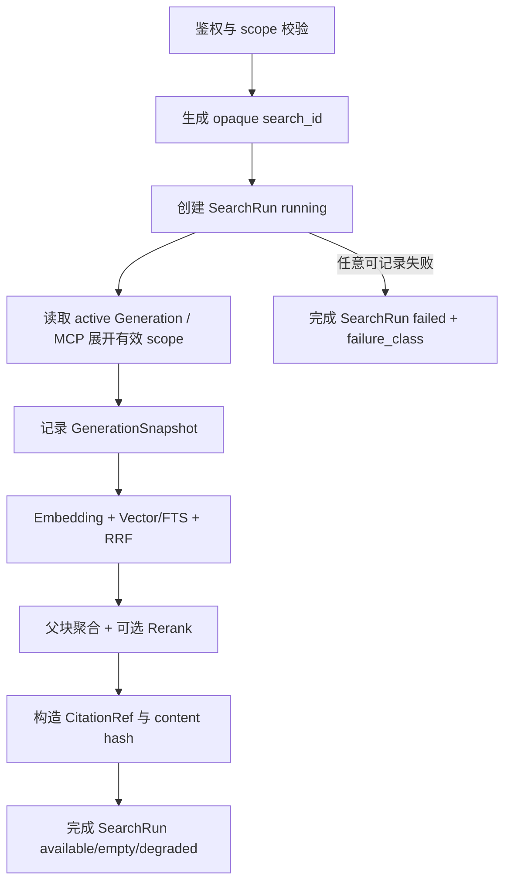

# 检索证据血缘与可回放检索设计

> 状态：提案（面向 v0.9.0）  
> 范围：Search Response、CitationRef、SearchRun、内部 Generation 回放  
> 不包含：LLM 答案生成、Agent Desk 审核、知识有效期治理、EvidenceQuality 校准、通用知识候选发布

## 1. 背景

琅嬛当前已经完成不可变 Document Revision、Chunk Revision、Index Generation 双缓冲、向量/FTS 混合检索、父子 Chunk、Rerank、多知识库检索和结构化搜索日志。当前定位仍然是知识处理层和 Evidence Provider，不生成答案，也不编排 Agent。

下一阶段的主要问题不是增加新的召回算法，而是让一次检索具备可解释、可关联、可审计和可回放的事实合同。当前 API 的 `SearchResult` 已经包含 Chunk、Chunk Revision、Document、Source Anchor 及分支分数，但缺少 Document Revision、Index Generation 和一次检索运行的稳定身份。底层 `retrieval_entries` 已经保存这些 lineage，因此本设计优先把已有事实安全地提升到应用协议，而不是重新设计检索算法。

当前 `score` 语义已经冻结：`score` 是 RRF 分数，`rerank_score` 是可选的重排分数，`ranking_stage` 表示实际排序阶段。该语义不在本设计中改名或引入含义模糊的 `final_score`。

## 2. 目标

本设计完成后，调用方应能回答以下问题：

1. 这次检索对应哪个 `search_id`？
2. 每条证据来自哪个 Document Revision、Chunk Revision 和 Index Generation？
3. 返回内容和来源锚点能否被验证？
4. 这次检索是有结果、无结果、降级还是失败？失败属于哪一类？
5. 在保留期内，是否能使用相同 Generation、Embedding 快照、检索参数和 Workspace Rerank 快照重放？
6. Agent Desk 是否只需保存 `search_id`，就能把反馈关联到琅嬛的检索事实，而不复制整份证据正文？

## 3. 非目标

- 不在琅嬛内保存原始 query、候选正文、向量或完整第三方响应。
- 不让公开 API Key 任意指定历史 Generation。
- 不承诺第三方 Embedding/Rerank 服务在模型名相同的情况下做到字节级确定性；本设计提供的是配置和版本可回放。
- 不在本期增加 `effective_from/effective_until`、`owner_id`、`review_status` 等业务有效期字段。若后续确实存在政策时效场景，应另立知识有效性规格。
- 不实现 `strong/weak/conflicting` 等 EvidenceQuality 结论。该能力必须建立在标注数据和校准方法之上，不能用未经验证的阈值伪装答案正确率。
- 不新增 `PublishKnowledgeCandidate` 聚合接口。现有文本导入和 FAQ 写入协议已经具备 Document/Revision/Job 链路，后续只在真实 Agent Desk 接入需要时增加白名单 metadata。
- 不改变 REST 单库搜索当前返回数组的兼容合同。

## 4. 方案比较与决策

### 4.1 响应元数据承载方式

| 方案 | 优点 | 代价 |
|---|---|---|
| 直接把单库数组改成 envelope | 结构最清晰 | 破坏现有 REST/MCP 客户端 |
| 所有字段复制到每个结果 | 客户端容易拿到 | 重复数据，且把运行级事实错误地变成结果级事实 |
| 应用层统一 envelope，单库 REST 用 Header，多库/MCP 用 wrapper | 保持兼容，运行级与结果级职责清晰 | 单库调用方需要读取响应 Header |

选择第三种。应用服务统一返回 `SearchResponse`；单库 REST 继续返回结果数组，同时写入 `X-Search-ID`、`X-Retrieval-Status` 和 `X-Generation-IDs` 响应头；多库 REST 和 MCP 在现有 wrapper 上增加运行元数据字段。内部回放接口直接返回完整 envelope。

### 4.2 SearchRun 持久化方式

| 方案 | 优点 | 代价 |
|---|---|---|
| 只依赖日志和 Trace | 无迁移、低存储 | 无法稳定关联和回放，日志保留策略不可控 |
| 保存 query 和完整结果 | 回放方便 | 隐私、存储和泄露风险过高 |
| 只保存运行元数据与 Generation 快照，query 由调用方再次提交 | 足够支持关联和配置回放，隐私边界清晰 | 琅嬛不能仅凭 search_id 还原原始 query |

选择第三种。`query_hash` 只用于验证回放请求是否是原问题，不能用于还原 query。Agent Desk 保存原始问题并在回放时重新提交；琅嬛不保存原始 query。

## 5. 领域与协议合同

### 5.1 SearchRun 状态

`retrieval_status` 是一次检索的最终协议状态，不等同于 HTTP 状态码。数据库记录在执行期间使用内部状态 `running`，该状态不会作为已完成的 API 响应返回：

| 状态 | 含义 |
|---|---|
| `available` | 检索成功并返回至少一条证据 |
| `empty` | 检索成功，但没有证据命中 |
| `degraded` | 返回证据，但发生了允许降级的情况，例如 Rerank 回退到 RRF |
| `failed` | 未能完成检索；`failure_class` 必填 |

未通过认证或资源授权校验的请求不向调用方返回 SearchRun 响应；服务端日志可以记录对应的稳定错误类别，但不得泄露资源存在性。

`failure_class` 使用稳定、脱敏的错误分类，至少覆盖：

```text
validation_error
not_found
forbidden
generation_not_ready
generation_stale
generation_not_available
embedding_unavailable
embedding_rate_limited
embedding_timeout
embedding_snapshot_mismatch
rerank_unavailable
rerank_rate_limited
rerank_timeout
rerank_snapshot_mismatch
invalid_embedding_response
invalid_rerank_response
internal_error
```

### 5.2 SearchRun DTO

应用层的规范返回对象为：

```go
type SearchResponse struct {
	Run     SearchRunSummary
	Results []*SearchResult
}

type SearchRunSummary struct {
	SearchID                  uuid.UUID
	WorkspaceID               uuid.UUID
	RequestedScope            value.SearchScope
	EffectiveScope            value.SearchScope
	EffectiveKnowledgeBaseIDs []uuid.UUID
	GenerationSnapshots       []GenerationSnapshot
	QueryHash                 string
	QueryChars                int
	VectorTopK                int
	KeywordTopK               int
	FinalTopK                 int
	RetrievalStatus           value.RetrievalStatus
	FailureClass              string
	RankingStage              value.RankingStage
	ResultCount               int
	CreatedAt                 time.Time
	CompletedAt               *time.Time
	ReplayOfID                *uuid.UUID
}

type GenerationSnapshot struct {
	KnowledgeBaseID       uuid.UUID
	GenerationID          uuid.UUID
	SourceContentVersion  int64
	IndexedContentVersion int64
	GenerationConfigHash  string
	EmbeddingModelID      uuid.UUID
	ProviderID            uuid.UUID
	ModelName             string
	ModelConfigHash       string
	EmbeddingDimension    int
	RetrievalConfigHash   string
	RerankSnapshot        *model.RerankSnapshot
}
```

`GenerationSnapshot` 是审计和回放所需的身份摘要，不包含 query、正文、向量或凭证。完整 Generation 配置仍以数据库不可变 Generation 为事实源；若该 Generation 已被清理，回放返回 `generation_not_available`，不尝试猜测替代 Generation。

`requested_scope=api_key_bound_all` 只在 MCP adapter 将空 `knowledge_base_ids` 展开为当前 API Key 绑定集合时使用。REST application service 仍要求显式 KnowledgeBase ID；不会把空数组隐式解释为全 Workspace。

### 5.3 SearchResult 与 CitationRef

在不改变现有分数语义的前提下，`SearchResult` 增加：

```go
DocumentRevisionID uuid.UUID
IndexGenerationID  uuid.UUID
Citation           CitationRef
```

`MatchedChild` 复用结果的 `DocumentRevisionID` 和 `IndexGenerationID`，自身继续携带 `ChunkRevisionID` 与 `SourceAnchor`。

```go
type CitationRef struct {
	DocumentRevisionID uuid.UUID
	ChunkRevisionID    uuid.UUID
	SourceAnchor       map[string]any
	ContentSHA256      string
	Status             value.CitationStatus // valid | unavailable
}
```

`ContentSHA256` 的算法合同固定为：对 API 返回的 `content` 字段按 UTF-8 字节计算 SHA-256，输出小写十六进制字符串。它与 File Revision 的原始资产 `DocumentRevision.SHA256` 不同，不得混用。 `SourceAnchor` 继续只表达位置，不塞入 Document/Revision lineage。

当前检索从数据库成功加载的证据固定返回 `citation.status=valid`。`unavailable` 为后续引用解析和历史资源清理场景预留，本期不新增 Citation 详情接口，也不把历史 Revision 自动标记为 `expired`，因为“过期”需要独立的业务有效期语义。

### 5.4 SearchRun 数据库

新增迁移 `000023_search_runs`，包含：

`search_runs`：

```text
id uuid primary key
workspace_id uuid not null
requested_scope text not null
query_hash text not null
query_chars integer not null
vector_top_k integer not null
keyword_top_k integer not null
final_top_k integer not null
retrieval_status text not null
failure_class text not null default ''
ranking_stage text not null default ''
result_count integer not null default 0
request_id text not null default ''
transport text not null default ''
principal_kind text not null default ''
created_at timestamptz not null
completed_at timestamptz
expires_at timestamptz not null
replay_of_id uuid null
```

`search_run_generations`：

```text
id uuid primary key
workspace_id uuid not null
search_run_id uuid not null
knowledge_base_id uuid not null
generation_id uuid not null
source_content_version bigint not null
indexed_content_version bigint not null
generation_config_hash text not null
embedding_model_id uuid not null
provider_id uuid not null
model_name text not null
model_config_hash text not null
embedding_dimension integer not null
retrieval_config_hash text not null
rerank_snapshot jsonb
```

所有表带 `workspace_id`，通过复合外键保证 SearchRun 与 Generation 快照不能跨租户。表中禁止保存原始 query、正文、向量、API Key secret 和第三方响应。

索引至少包括：

- `(workspace_id, id)` 唯一约束；
- `(workspace_id, created_at)`，供保留期清理；
- `(workspace_id, query_hash, created_at)`，供受限诊断；
- `search_run_generations (workspace_id, search_run_id)`。

默认 SearchRun 保留 168 小时，通过 `retrieval.search_run_retention` 配置，且不得长于 `retrieval.retired_generation_retention`。需要更长反馈窗口时必须同时提高两项配置。清理必须批量、可中断、只删除已过 `expires_at` 的运行，并先于 retired Generation projection 清理执行。

### 5.5 检索执行流程



SearchRun 的创建和完成不加入检索候选读取事务。SearchRun 写入失败不能覆盖原始检索结果或原始领域错误；服务端记录 `search_run_persistence_failed`，调用方仍收到原始搜索结果/错误。

SearchRun 创建后发生执行错误时，应用服务返回“非空 `SearchResponse` + error”：Response 只包含已完成为 `failed` 的 RunSummary，Results 为空。HTTP adapter 先写 SearchRun 响应头，再映射原领域错误；MCP adapter 返回 `isError=true` 的结构化错误，并附带 `search_id` 与 `failure_class`。鉴权、scope 或基础输入校验在 SearchRun 创建前失败时仍返回普通错误，不生成 `search_id`。

单库与多库使用同一套状态和记录器：

- 单库记录一个 GenerationSnapshot；
- 多库记录每个实际参与检索的 KnowledgeBase/Generation；
- MCP 空 scope 在 adapter 展开后，SearchRun 同时记录 requested/effective scope；
- Rerank fallback 有结果时状态为 `degraded`，`ranking_stage=rrf_fallback`；
- 0 结果为 `empty`，不是失败。

### 5.6 内部 Generation 回放

新增仅供 Workspace owner/admin 和内部评测调用的接口：

```text
POST /api/v1/workspaces/:workspace_slug/search-runs/:search_id/replay
```

请求体：

```json
{"query":"原始问题"}
```

约束：

1. 调用方必须属于同一 Workspace，并具备 owner/admin 角色；Bearer API Key 不可调用。
2. 服务端用规范化 query 计算 `query_hash`，必须与原 SearchRun 一致，否则返回 `search_query_mismatch`。
3. 回放使用 SearchRun 记录的有效 KnowledgeBase 集合、Generation ID、topK、Generation 配置和 Rerank snapshot；请求不能覆盖这些字段。
4. 当前调用方若已无权访问原有效 scope，返回统一的 `not_found` 或 `forbidden`，不泄露历史权限细节。
5. Generation 或其 published retrieval projection 已被清理时，返回 `generation_not_available`。
6. 回放创建一个新的 SearchRun，并设置 `replay_of_id` 指向原运行；原运行不可变。
7. 回放结果返回完整 `SearchResponse`，用于内部评测，不改变公开 Search API 的数组合同。

应用服务通过内部 `SearchSnapshotOverride` 传递固定 Generation，不在 HTTP/MCP 公开输入结构中暴露 `generation_id`。普通搜索继续只解析 active Generation。

### 5.7 REST 与 MCP 兼容性

单库 REST：

- body 继续为 `[]SearchResult`；
- 增加 `X-Search-ID`；
- 增加 `X-Retrieval-Status`；
- 增加 `X-Generation-IDs`，多个 UUID 以逗号分隔；
- SearchRun 创建后的失败响应同样写入前三个 Header，body 继续使用现有稳定错误结构；
- OpenAPI 描述这些响应头。

多库 REST：现有 wrapper 保留，并增加：

```json
{
  "search_id":"...",
  "requested_scope":"selected",
  "effective_scope":"selected",
  "retrieval_status":"available",
  "generation_ids":["..."],
  "searched_knowledge_base_ids":["..."],
  "results":[...]
}
```

MCP `knowledge_search`：保留现有 `searched_knowledge_base_ids/results`，增加 `search_id`、`requested_scope`、`effective_scope`、`retrieval_status` 和 `generation_ids`。SearchRun 创建后的工具错误在既有稳定错误对象中增加 `search_id` 与 `failure_class`。工具描述明确：空 `knowledge_base_ids` 只代表当前 API Key 绑定集合，不代表 Workspace 全量。

### 5.8 安全、隐私与权限

- Query 不进入 SearchRun、Info 日志、OTel attributes 或 MCP 错误文本。
- `query_hash` 使用 SHA-256，固定 canonicalization 版本；hash 不能作为授权凭证。
- SearchRun 所有读取和删除都显式带 `workspace_id`。
- 回放按当前权限重新校验，不继承原请求权限。
- SearchRun ID 使用 UUIDv7/opaque 字符串，不暴露数据库自增信息。
- CitationRef 只返回调用方本来有权获取的证据，不因 Citation 字段扩大资源范围。
- 运行元数据的保留期到期后物理删除；删除不影响 Document、Revision、Generation 和 retrieval projection。

## 6. 测试与验收

### 单元测试

- RetrievalStatus/CitationStatus 的合法值和非法值；
- query canonicalization 与 hash 稳定性；
- `content_sha256` 对 UTF-8 内容的确定性；
- RRF、Rerank、fallback 对 SearchRun 状态的映射；
- SearchRun 持久化失败不覆盖原搜索错误；
- 回放 query hash 不匹配、Generation 不可用、权限不足；
- 单库和多库 GenerationSnapshot 数量及 scope 语义。

### 数据库集成测试

必须使用测试期间启动的 `langhuan-test-postgres:pg17` 临时容器：

- 从空库执行全部迁移；
- SearchRun 与 Generation 快照成功写入；
- 跨 Workspace 读取、更新、删除均被拒绝；
- 过期 SearchRun 批量清理不删除未过期记录；
- 复合外键阻止跨 Workspace SearchRun/Generation 关联；
- Generation 清理后回放返回 `generation_not_available`。

### HTTP/MCP/E2E

- 单库 REST body 仍为数组，同时校验三个响应头；
- 多库 REST/MCP 返回运行元数据且不改变既有结果字段；
- MCP 空 scope 展开为 API Key 绑定集合并记录 `api_key_bound_all`；
- API Key 不能调用 replay；
- owner/admin 可以回放同 Workspace SearchRun；
- query hash 不匹配、跨 Workspace、历史 Generation 不可用均返回稳定错误；
- `go test ./...`、`go vet ./...` 和 `git diff --check` 通过。

## 7. 验收标准

1. 每次成功检索都有可关联的 `search_id`，并能定位到一个或多个 GenerationSnapshot。
2. 每个结果能定位到 Document Revision、Chunk Revision 和 Index Generation。
3. CitationRef 的 hash 能复算返回内容；Source Anchor 仍只表达位置。
4. 0 结果、Rerank fallback 和失败在协议和日志中可区分。
5. SearchRun 不保存 query、正文、向量或凭证。
6. 在 SearchRun 保留期和 Generation projection 保留期内，owner/admin 可用原 query 回放；query 不一致或资源已清理时明确失败。
7. 现有单库 REST、MCP 结果字段和 API Key 租户边界保持兼容。

## 8. 后续独立规格

- 知识有效期、supersedes 和冲突组；
- 基于 qrels 的 Recall/MRR/nDCG 离线评测；
- EvidenceQuality 校准与 Agent Desk Response Policy；
- Agent Desk 到琅嬛的候选知识发布协议；
- REST 的显式 `all` scope（如确有需要）。
